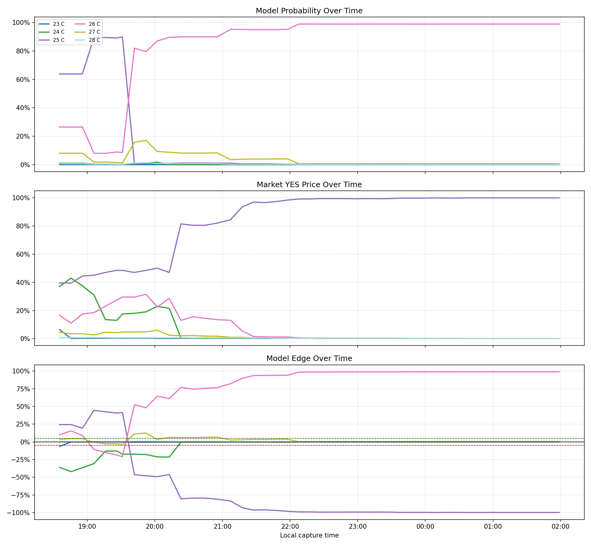
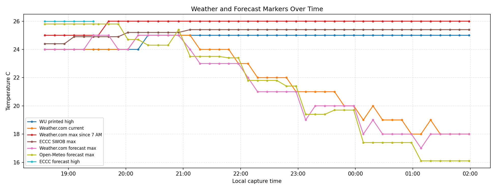
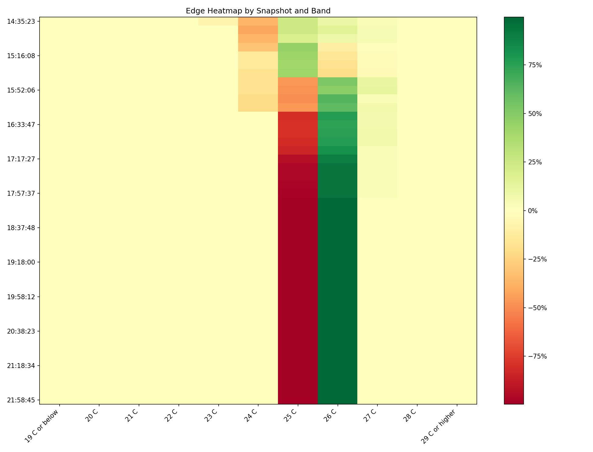

# Snapshot Analytics Report

**Event:** `highest-temperature-in-toronto-on-may-27-2026`  
**Source CSV:** `data/snapshots/highest-temperature-in-toronto-on-may-27-2026/snapshots_long.csv`  
**Report Generated:** `2026-05-27 21:59:48`  
**Analyzed Snapshots:** 45 snapshots, 495 band rows, 11 bands  
**Capture Window:** `2026-05-27 14:35:23 -0400` to `2026-05-27 21:58:45 -0400` local time  
**Edge Threshold:** 5.0%

## Detailed Design

This report treats `snapshots_long.csv` as the immutable tape of model, market, and source-state observations.

- Validate schema, duplicated snapshot-band rows, expected row coverage, and capture cadence.
- Summarize each price band by model movement, market movement, edge extremes, and persistence.
- Surface latest positive and negative edges separately from historical edge episodes.
- Track realized/live weather markers alongside market snapshots so forecast and observed-temperature context stays auditable.
- Emit stable artifacts: `analytics_report.md`, `snapshots_analytics.png`, `weather_markers.png`, and `edge_heatmap.png`.

## Data Quality

| Check | Result | Detail |
| :--- | :--- | :--- |
| Required columns | PASS | All 11 required columns are present. |
| Snapshot-band coverage | PASS | 495 rows observed; 495 expected from 45 snapshots x 11 bands. |
| Duplicate snapshot-band rows | PASS | 0 |
| Missing numeric values | PASS | edge=0, market_yes=0, model_probability=0 |
| Timestamp parsing | PASS | 0 rows failed timestamp parsing. |
| Capture cadence | INFO | median 10.0m, max gap 12.1m |

## Latest Snapshot

Latest snapshot `20260527T215845-0400` was captured at `2026-05-27 21:58:45 -0400`.

| Range | Model | Market Yes | Edge | Best Bid | Best Ask | Last |
| :--- | :--- | :--- | :--- | :--- | :--- | :--- |
| 19 C or below | 0.0% | 0.1% | -0.0% | - | 0.1% | 0.4% |
| 20 C | 0.0% | 0.1% | -0.0% | - | 0.1% | 0.4% |
| 21 C | 0.0% | 0.1% | -0.0% | - | 0.1% | 0.1% |
| 22 C | 0.0% | 0.1% | -0.0% | - | 0.1% | 0.1% |
| 23 C | 0.0% | 0.1% | -0.0% | - | 0.1% | 0.1% |
| 24 C | 0.0% | 0.1% | -0.0% | - | 0.1% | 0.1% |
| 25 C | 0.3% | 100.0% | -99.7% | 99.9% | 100.0% | 99.9% |
| 26 C | 98.9% | 0.1% | +98.9% | - | 0.1% | 0.4% |
| 27 C | 0.7% | 0.1% | +0.6% | - | 0.1% | 0.6% |
| 28 C | 0.1% | 0.1% | +0.0% | - | 0.1% | 1.0% |
| 29 C or higher | 0.0% | 0.1% | -0.0% | - | 0.1% | 0.7% |

## Weather Markers

| Marker | Latest | First | Max | Max Time | Min |
| :--- | :--- | :--- | :--- | :--- | :--- |
| WU printed high | 25.0 C | 24.0 C | 25.0 C | 16:23:09 | 24.0 C |
| Weather.com current | 18.0 C | 24.0 C | 25.0 C | 16:12:47 | 18.0 C |
| Weather.com max since 7 AM | 26.0 C | 25.0 C | 26.0 C | 15:41:53 | 25.0 C |
| ECCC SWOB max | 25.4 C | 24.4 C | 25.4 C | 17:07:12 | 24.4 C |
| Weather.com forecast max | 18.0 C | 24.0 C | 25.0 C | 15:26:09 | 17.0 C |
| Open-Meteo forecast max | 16.1 C | 25.8 C | 25.8 C | 14:35:23 | 16.1 C |
| ECCC forecast high | 26.0 C | 26.0 C | 26.0 C | 14:35:23 | 26.0 C |

## Bucket Summary

| Range | First Model | Last Model | Model Move | First Market | Last Market | Market Move | Max Edge | Min Edge | Longest +Edge | Longest Threshold Edge | Crossings |
| :--- | :--- | :--- | :--- | :--- | :--- | :--- | :--- | :--- | :--- | :--- | :--- |
| 19 C or below | 0.0% | 0.0% | +0.0% | 0.1% | 0.1% | +0.0% | -0.0% | -0.0% | - | - | 0 |
| 20 C | 0.0% | 0.0% | +0.0% | 0.1% | 0.1% | +0.0% | -0.0% | -0.0% | - | - | 0 |
| 21 C | 0.0% | 0.0% | +0.0% | 0.1% | 0.1% | +0.0% | -0.0% | -0.0% | - | - | 0 |
| 22 C | 0.0% | 0.0% | +0.0% | 0.2% | 0.1% | -0.1% | -0.0% | -0.2% | - | - | 0 |
| 23 C | 0.0% | 0.0% | +0.0% | 6.4% | 0.1% | -6.3% | -0.0% | -6.4% | - | 1 obs / 0.0m | 1 |
| 24 C | 1.0% | 0.0% | -1.0% | 37.0% | 0.1% | -37.0% | -0.0% | -42.0% | - | 11 obs / 97.4m | 1 |
| 25 C | 63.8% | 0.3% | -63.5% | 39.5% | 100.0% | +60.5% | +44.5% | -99.7% | 7 obs / 55.9m | 45 obs / 443.4m | 2 |
| 26 C | 26.5% | 98.9% | +72.5% | 16.5% | 0.1% | -16.4% | +98.9% | -20.9% | 38 obs / 376.9m | 45 obs / 443.4m | 3 |
| 27 C | 8.0% | 0.7% | -7.4% | 4.5% | 0.1% | -4.5% | +12.3% | -3.5% | 38 obs / 376.9m | 5 obs / 42.3m | 2 |
| 28 C | 0.6% | 0.1% | -0.5% | 0.8% | 0.1% | -0.7% | +0.7% | -0.5% | 22 obs / 211.0m | - | 0 |
| 29 C or higher | 0.1% | 0.0% | -0.1% | 0.5% | 0.1% | -0.5% | -0.0% | -0.5% | - | - | 0 |

## Edge Episodes

| Range | Direction | Start | End | Duration | Observations | Peak Edge | Peak Time |
| :--- | :--- | :--- | :--- | :--- | :--- | :--- | :--- |
| 25 C | negative | 15:41:53 | 21:58:45 | 376.9m | 38 | -99.7% | 20:58:29 |
| 26 C | positive | 15:41:53 | 21:58:45 | 376.9m | 38 | +98.9% | 21:18:34 |
| 25 C | positive | 14:35:23 | 15:31:16 | 55.9m | 7 | +44.5% | 15:05:57 |
| 24 C | negative | 14:35:23 | 16:12:47 | 97.4m | 11 | -42.0% | 14:45:41 |
| 26 C | negative | 15:05:57 | 15:31:16 | 25.3m | 4 | -20.9% | 15:31:16 |
| 26 C | positive | 14:35:23 | 14:55:47 | 20.4m | 3 | +15.5% | 14:45:41 |
| 27 C | positive | 15:41:53 | 15:52:06 | 10.2m | 2 | +12.3% | 15:52:06 |
| 27 C | positive | 16:12:47 | 16:55:07 | 42.3m | 5 | +6.6% | 16:55:07 |
| 23 C | negative | 14:35:23 | 14:35:23 | 0.0m | 1 | -6.4% | 14:35:23 |

## Threshold Crossings

| Time | Range | Direction | Previous Edge | Current Edge |
| :--- | :--- | :--- | :--- | :--- |
| 14:35:23 | 23 C | negative | - | -6.4% |
| 14:35:23 | 24 C | negative | - | -36.0% |
| 14:35:23 | 25 C | positive | - | +24.3% |
| 14:35:23 | 26 C | positive | - | +10.0% |
| 15:05:57 | 26 C | negative | +9.0% | -10.5% |
| 15:41:53 | 25 C | negative | +41.4% | -46.4% |
| 15:41:53 | 26 C | positive | -20.9% | +52.4% |
| 15:41:53 | 27 C | positive | -3.5% | +11.0% |
| 16:12:47 | 27 C | positive | +3.4% | +6.3% |

## Charts

### Odds and Edge Timeline

### Weather Marker Timeline

### Edge Heatmap

## Automated Takeaways

- Largest positive edge: **26 C** at +98.9%.
- Largest negative edge: **25 C** at -99.7%.
- Longest threshold episode: **25 C** (negative) for 376.9m across 38 snapshots.
- Largest market move: **25 C** moved +60.5%.
