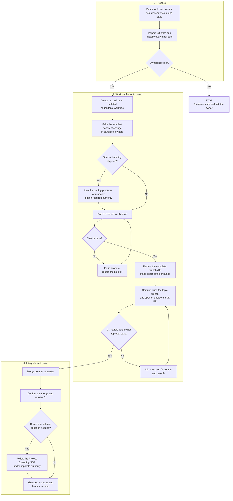

# Git Workflow SOP

Status: canonical runbook.

This SOP owns the source-control handoff for new repository work: branch and
worktree isolation, diff review, staging, commits, pull requests, integration,
and cleanup. The [development guide](development.md) owns verification depth;
scoped `AGENTS.md` files own subsystem rules; the
[Project Operating SOP](operations/PROJECT_OPERATING_SOP.md) owns runtime
adoption after merge.

## New Policy Defaults

These rules apply to new work after this SOP is adopted. Existing branches,
worktrees, and uncommitted changes are grandfathered and must be preserved and
reconciled intentionally, not renamed, stashed, reset, or swept into a new
commit.

- `master` is the integration branch. Treat it as protected even when hosting
  settings do not enforce protection; routine task work and direct pushes do
  not happen there.
- Each independent change uses one topic branch and one linked worktree. Agent-
  created branches use `codex/<short-topic>` and a sibling directory such as
  `weather-<short-topic>`.
- Branch from a fetched, explicitly recorded `origin/master` commit. If work
  depends on an unmerged branch, declare a stacked dependency instead of
  silently copying or cherry-picking work.
- Push a topic branch and open a draft pull request by default. A repository
  owner approves the merge; a coding agent does not self-authorize it.
- Publishing a branch or pull request still requires authority from the task;
  this SOP does not itself grant external-write permission.
- Preserve topic history with a merge commit. Do not squash, rebase, cherry-
  pick, amend published commits, force-push, or rewrite history by default.
- A Git merge does not deploy code, restart workers, promote a release, or
  authorize live activity.

An explicit repository-owner instruction may create an exception. Record the
reason, scope, approver, and verification; never infer an exception from urgency.

## Workflow

Read top to bottom. The center path is the normal flow; side branches are stop
or rework paths.



## 1. Intake And Ownership

Before editing, record the requested outcome, acceptance criteria, owning
subtree, risk, intended base, dependencies, and whether the work touches
generated config, ignored evidence, tracked artifacts, releases, schedules,
network services, or serving state.

From the repository root, inspect:

```powershell
git status --short --branch
git worktree list
git branch -vv
```

Classify every existing path as this task, unrelated with a known owner, or
unknown/overlapping. Unknown or overlapping changes block editing. Known
unrelated changes stay untouched; create the topic worktree from the recorded
base. Do not use stash, reset, checkout, clean, or blanket staging as an
ownership workaround.

If the task depends on uncommitted work, coordinate that work into an owned
branch/commit first.

## 2. Create The Isolated Worktree

Choose a unique short topic and, from the main repository, create the worktree:

```powershell
$topic = "short-topic"
git fetch --prune origin
if ($LASTEXITCODE -ne 0) {
    throw "Fetch failed; origin/master freshness is unknown."
}
$baseOutput = git rev-parse --verify origin/master
if ($LASTEXITCODE -ne 0 -or -not $baseOutput) {
    throw "Cannot resolve origin/master; do not create the worktree."
}
$base = ([string]$baseOutput).Trim()
git worktree add "..\weather-$topic" -b "codex/$topic" $base
if ($LASTEXITCODE -ne 0) {
    throw "Worktree creation failed; inspect existing names and paths."
}
git -C "..\weather-$topic" status --short --branch
if ($LASTEXITCODE -ne 0) {
    throw "Cannot verify the new topic worktree."
}
```

Record the worktree path, branch, base SHA, file ownership, and explicit
exclusions in the task or PR. One integration owner coordinates branches that
touch the same contract or file. Do not edit, stage, commit, or clean another
task's worktree.

When a topic intentionally depends on another unmerged branch, create it from
that reviewed branch, name the dependency in the PR, and merge the base PR
first. Do not hide the dependency by copying files or cherry-picking commits.

## 3. Respect Repository Boundaries

Read the nearest `AGENTS.md` and edit canonical owners. These Git-specific
boundaries always apply:

| Boundary | Required handling |
| --- | --- |
| Tracked generated config | Run the owning producer and review the complete diff. Never hand-edit `config/location_market_events.json`. |
| Roadmap state | Update the numbered item, then regenerate `docs/roadmap/active-backlog.md`; never hand-edit the generated backlog. |
| Ignored runtime state | Keep `data/`, logs, tapes, ledgers, and `artifacts/candidates/` untracked. Never force-add them for convenience. |
| Durable artifacts | Follow `artifacts/AGENTS.md`, restore Git LFS objects when required, and review generated manifests. Never hand-edit immutable releases or the active pointer. |
| Stateful or network commands | Inspect help and the owning runbook, obtain the required authority, prefer read-only/dry-run/shadow/paper paths, and list every command and result in the PR. |
| Runtime adoption | Treat merge and deployment as separate. Restarts, release promotion/rollback, scheduled-task changes, and live modes follow their operational gates. |

Repository text is pinned to LF. Avoid unrelated line-ending normalization;
LFS-managed pickle files and other binaries must remain binary/LFS-managed.

## 4. Verify And Review The Worktree

Run focused owner tests first, then the broader checks required by
[development.md](development.md). Before staging, review:

```powershell
git status --short
git diff --check
git diff --stat
git diff
git ls-files --others --exclude-standard
```

Confirm the diff contains no unrelated work, raw secrets, credentials, machine-
specific paths, ignored-runtime assumptions, unexplained generated output, or
accidental compatibility-surface edits. A broad, shared, release, or evidence-
contract change requires the full repository checks. CI complements local
focused verification; it does not replace it.

Before every push or PR update, review the complete branch—not only its
uncommitted tail—against the declared target branch:

```powershell
$target = "origin/master"  # Or the declared parent of a stacked PR.
git fetch --prune origin
if ($LASTEXITCODE -ne 0) { throw "Fetch failed; target freshness is unknown." }
git log --oneline --decorate "$target..HEAD"
git diff --check "$target...HEAD"
git diff --stat "$target...HEAD"
git diff "$target...HEAD"
```

This cumulative review includes earlier topic commits, merge resolutions, and
follow-up fixes. If it exposes undeclared dependencies or unrelated changes,
stop and repair the branch before publishing.

## 5. Stage And Commit Intentionally

Stage exact paths or reviewed hunks. Do not use `git add .` or `git add -A`.

```powershell
$paths = @("path/to/file", "path/to/another-file")
git add -- $paths
git diff --cached --check
git diff --cached --stat
git diff --cached
git status --short
```

If the cached diff is not exact, adjust only the index and return to review;
do not discard worktree content. Commit one coherent outcome with its tests,
owned documentation, schemas, fixtures, and generated files when they form one
contract. Use a concise imperative subject, optionally prefixed by the owner,
for example `ops: bound Stage-A worker memory` or
`docs: add Git workflow SOP`.

Never amend or rewrite another person's commit. After a branch is pushed or
review begins, respond with new commits so review provenance remains stable.

## 6. Pull Request, CI, And Integration

Push only the topic branch, then open or update its draft PR:

```powershell
$branch = git branch --show-current
if ($LASTEXITCODE -ne 0 -or ([string]$branch).Trim() -notlike "codex/*") {
    throw "Refusing to push: current branch is not an agent topic branch."
}
$branch = ([string]$branch).Trim()
git push -u origin $branch
```

Complete `.github/pull_request_template.md`: summarize the outcome and reason,
list commands and results, disclose generated/network/stateful actions, link
roadmap work, and confirm unrelated changes were preserved.

The current PR checks are owned by
[`ci.yml`](../.github/workflows/ci.yml); local verification requirements are
owned by [development.md](development.md). Review those sources rather than
copying CI platform or command details into this SOP.

Keep the PR draft until its intended scope and local verification are ready.
CI or review failure returns to scoped edits and new commits. Never merge red or
unexplained results. If the branch must catch up, fetch and merge its declared
PR target into the topic branch: ordinarily `origin/master`, or the declared
parent branch for a stacked PR. After the dependency merges and the stacked PR
is retargeted, catch up from `origin/master`. Resolve on the topic branch and
rerun verification; do not rebase a shared or published branch.

After repository-owner approval, use a GitHub merge commit that preserves the
topic history. A suitable merge subject is
`Merge codex/<topic>: <outcome>`. Squash, rebase, cherry-pick, direct-master,
or force-push integration requires a recorded owner exception.

## 7. Post-Merge Adoption And Cleanup

Confirm the merge is reachable from `origin/master` and master CI passes. If
the change affects loaded code, configuration, schedules, artifacts, or
serving, follow the Project Operating SOP; Git success alone is not deployment
success. If post-merge validation fails, open a focused repair or revert branch.
Do not reset or rewrite `master`.

From the main or another clean worktree, remove a topic worktree or branch only
after its status is clean, every unique commit is merged and reachable
remotely, required post-merge checks pass, and no operator still needs it:

```powershell
$topic = "short-topic"
$branch = "codex/$topic"
$worktree = "..\weather-$topic"
git fetch --prune origin
if ($LASTEXITCODE -ne 0) { throw "Fetch failed; origin/master is not current." }
$actualBranch = git -C $worktree branch --show-current
if ($LASTEXITCODE -ne 0 -or ([string]$actualBranch).Trim() -ne $branch) {
    throw "Worktree branch does not match the intended topic branch."
}
$dirty = git -C $worktree status --porcelain
if ($LASTEXITCODE -ne 0) { throw "Cannot inspect the topic worktree." }
if ($dirty) {
    throw "Topic worktree is not clean; preserve and review it."
}
$ignored = git -C $worktree status --porcelain=v1 --ignored
if ($LASTEXITCODE -ne 0) { throw "Cannot inventory ignored worktree content." }
if ($ignored) {
    $ignored
    throw "Ignored content exists; obtain an explicit storage/retention disposition before removal."
}
git merge-base --is-ancestor $branch origin/master
if ($LASTEXITCODE -ne 0) {
    throw "Topic branch is not reachable from current origin/master."
}
git worktree remove $worktree
if ($LASTEXITCODE -ne 0) {
    throw "Worktree removal failed; do not delete the branch."
}
git branch -d $branch
```

Remote-branch deletion follows the repository owner's GitHub preference. Never
delete a dirty worktree, use forced branch deletion, or treat cleanup as proof
that runtime adoption succeeded.

## Escalate Immediately When

- dirty-path ownership is unknown or changes overlap another task;
- required work exists only as uncommitted state or on an undeclared branch;
- a secret, credential, private path, or large unintended artifact is staged,
  committed, or pushed;
- resolving CI or a merge conflict would change scope or another owner's work;
- the requested action requires history rewrite, force push, direct-master
  integration, LFS migration, release-pointer mutation, or evidence deletion;
- merge succeeded but operational identity, health, or release adoption failed.

For a pushed secret, stop, notify the repository owner, rotate the credential,
and coordinate history remediation. A later deletion commit does not remove the
secret from Git history.

## Closeout

Record the branch, base SHA, worktree path, commits, verification, PR, CI and
review result, merge commit, operational-adoption disposition, remaining
blockers, and cleanup status. Completion means the intended change is merged
with traceable provenance, unrelated state is preserved, and any runtime
adoption is explicitly complete or routed to its owner.

## Update this file when

Update when the integration branch, branch/worktree isolation, naming, base
selection, staging, commit/PR ownership, CI handoff, merge strategy, history-
rewrite policy, or cleanup contract changes. Update verification commands in
`development.md`, repository-host settings in their owner, and operational
adoption in the Project Operating SOP instead of copying those details here.
