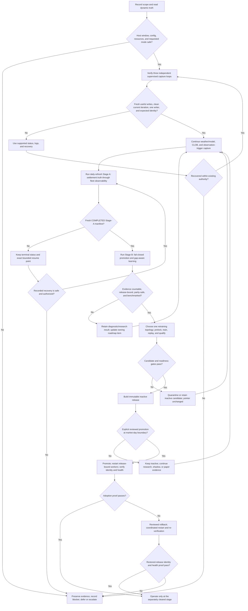

# Project Operating SOP

Status: canonical runbook.

This is the top-level operating flow for the weather-market platform. It joins
continuous capture, settlement, evaluation, candidate training, and reviewed
release adoption while leaving exact schedules, thresholds, and commands with
their owning runbooks.

The default posture is research, read-only, shadow, or paper. Live capital is
unauthorized unless explicitly requested and every current readiness, release,
risk, credential, and confirmation gate passes. For code-change workflow, use
the [development guide](../development.md).

## Establish Current Truth

This SOP defines the procedure, not whether today's run passed. Read these at
the start of every operating cycle:

| Question | Source of truth |
| --- | --- |
| What work or proof remains open? | [Generated active backlog](../roadmap/active-backlog.md) and linked numbered items |
| What tasks are installed? | Windows Task Scheduler; compare actions, arguments, triggers, and settings with `scripts/ops/` |
| Are capture and pipelines healthy now? | Canonical status commands and ignored local status/report files under `data/` |
| Which market, unit, event, and source contracts apply? | Checked-in config/registry and [Agent Context](AGENT_CONTEXT.md) |
| What is serving? | Verified active pointer and its complete immutable release graph |

A clean checkout has no local `data/` state. Missing evidence is `UNKNOWN` or
`BLOCK`, never an inferred pass. Preserve a dirty worktree; it may continue to
capture, but it cannot support a clean-source or release claim until its owner
reconciles it.

## Non-Negotiable Rules

- Use each market's native settlement unit. Legacy `_c` names do not establish
  units.
- Configured Weather Underground history is the settlement proxy. Other
  observations remain support unless a specific contract promotes them.
- Preserve append-only tapes, ledgers, captured inputs, and trading evidence.
  Recovery never starts with deletion.
- A fresh heartbeat on stale code, incomplete probability mass, mixed release
  identity, missing parity, or non-countable label is not a pass.
- Candidate construction never activates a release. Promotion, rollback, and a
  higher execution stage are separate reviewed actions.

## End-To-End Flow

## Operating Procedure

| Phase | Required action and exit condition | Procedure owner |
| --- | --- | --- |
| 1. Scope | Record markets, local target dates, native units, evidence lane, requested mode, checkout/release identity, effective WU cutoff, expected outputs, and deciding gate. | [Agent Context](AGENT_CONTEXT.md) |
| 2. Host and task preflight | Confirm the host policy admits the work. Compare installed task actions, arguments, triggers, and settings with the intended registration scripts; task names and last results alone are insufficient. | [Host Load Policy](HOST_LOAD_POLICY.md), `scripts/ops/` |
| 3. Capture | Require fresh useful writes, a clean completed iteration, one writer, and expected code/release identity for snapshot, CLOB, and observation-trigger loops. The dashboard is a cockpit, not a supervisor. | [Operations Design](OPERATIONS_DESIGN.md) |
| 4. Stage A | Run bounded source/settlement work through fleet observability. Isolated children must remain inside declared resource gates. Exit with a fresh `COMPLETED` Stage-A manifest; a settled-day barrier block makes the manifest critical and blocks promotion, but does not suppress the learning lane. | [Root command catalog](../../README.md), [`daily_refresh_registry.py`](../../src/weather/operations/daily_refresh_registry.py) |
| 5. Stage B | Recompute promotion evidence, scorecards, parity, shadow monitors, audits, and daily learning from the fresh Stage-A manifest. Promotion remains fail-closed on missing, blocked, or target-mismatched current-run receipts; independent evidence and learning continue over the last settled corpus with per-step own/dependency/not-applicable coverage and staleness. Stage-B completion is bound to the exact Stage-A run. Heavy-step deferral does not suppress later lightweight learning; physical-resource and isolated-orchestration failures remain global hard stops. | [Daily-refresh registration](../../scripts/ops/register_daily_refresh.ps1) |
| 6. Evaluate | Keep evidence lanes separate. Require countable labels, complete probability partitions, release/runtime lineage, replay/serve and train/serve parity, proper scoring against captured market prices, and claim-appropriate protected slices/costs. | [Point-In-Time Evaluation](POINT_IN_TIME_EVALUATION.md) |
| 7. Candidate | Enable exactly one topology: bounded single-host window or separately admitted direct scheduling. Production mode prelocks candidate-independent data before training. Output remains inactive. | [Nightly Retrain Runbook](NIGHTLY_RETRAIN_RUNBOOK.md) |
| 8. Release | Require explicit authorization, verified immutable graph, reviewed PASS decision, fresh matching boundary proof, and current readiness evidence. Promotion never belongs to the daily/nightly schedule. | [Nightly Retrain Runbook](NIGHTLY_RETRAIN_RUNBOOK.md) |
| 9. Adopt or roll back | Restart every release-bound worker and verify pointer, graph, runtime identity, health, and useful writes. If adoption fails, use reviewed rollback and repeat restart/verification. | [Operations Design](OPERATIONS_DESIGN.md), [Nightly Retrain Runbook](NIGHTLY_RETRAIN_RUNBOOK.md) |

`--continue-on-error` produces a fuller report; it does not convert blockers
into passes. Resource containment authorizes an attempt, not a completion
claim, and its limits must not be loosened merely to force a run through.

## Read-Only Triage

Use the canonical status commands from the
[Operations Design](OPERATIONS_DESIGN.md#startup-after-reboot) and
[root README](../../README.md#scheduled-operations). Also inspect scheduled
task definitions, not only their last result.

For the adopted single-host topology, inspect both `WeatherTrainingWindow` and
`WeatherTrainingWindowRestore`, plus
`data/logs/training_window_status.json`. The direct
`weather.operations.nightly_retrain status` command describes the direct task;
a disabled direct task is not itself a fault when the training window is the
chosen topology. For a direct topology, use that status and the exact evidence
bindings required by its registration script.

Validate event metadata through the daily/config owner and verify any active
release through the release/readiness owner linked above. Do not infer either
condition from file existence alone. Status and dry-run paths do not authorize
task registration, restart, pipeline resume, promotion, rollback, or live
exchange actions.

## Recovery And Escalation

| Condition | Required response |
| --- | --- |
| Capture stale, duplicated, erroring, or on unexpected identity | Preserve tapes; inspect worker status, supervisor sidecar, diagnostics, and console; use the supported component recovery; re-verify. If it cannot recover within existing authority, defer and escalate. |
| Stage A interrupted or resource-blocked | Trust its durable terminal status. Verify the recorded owner is dead before supported stale-lock repair, then use the exact recorded bounded resume command. Never edit status or restart blindly from step one. |
| Settlement incomplete or non-countable | Keep it diagnostic; repair source/label lineage through the owning bounded step. Never substitute a supporting source for WU truth. |
| Leakage, parity, mass, coverage, source-quality, release, or readiness gate fails | Quarantine or retain the candidate and leave the active pointer unchanged. No manual override may create a pass. |
| Nightly window missed, blocked, or failed | First confirm capture restoration and the dead-man task state; record the first blocker. A deliberate training gap is not clean continuous-capture evidence. |
| Post-promotion identity or health fails | Stop the adoption claim; perform reviewed rollback at a boundary, restart, and attach post-restart identity/health proof. |
| Disk pressure or apparent duplicate data | Inventory, classify, archive, and review an exact cleanup manifest. Never delete by age, size, or filename similarity. |

Escalate whenever recovery requires new credentials, live exchange access,
weaker gates, a manual label override, broader external-state mutation, or
deletion of canonical evidence.

## Closeout

Record or link:

- scope, target dates, units, evidence lane, and operating mode;
- checkout, config, active release, and worker runtime identities;
- task/capture/daily/nightly timestamps and terminal dispositions;
- first failed gate, exact recovery or resume action, and countability result;
- owning status/report/manifest paths and hashes;
- any restart, promotion, rollback, reviewer, and boundary proof;
- the numbered roadmap item owning unfinished work.

The cycle is complete only when capture is healthy or safely restored, every
pipeline has a truthful terminal state, evidence has an explicit countability
classification, active state did not change without review, and unfinished
work is routed to its canonical owner.

## Update this file when

Update when the top-level handoff, Stage-A/Stage-B gate contract, readiness
decisions, retraining topology, or procedure ownership changes. Update exact
commands, schedules, thresholds, schemas, and output paths in their canonical
owner first.
