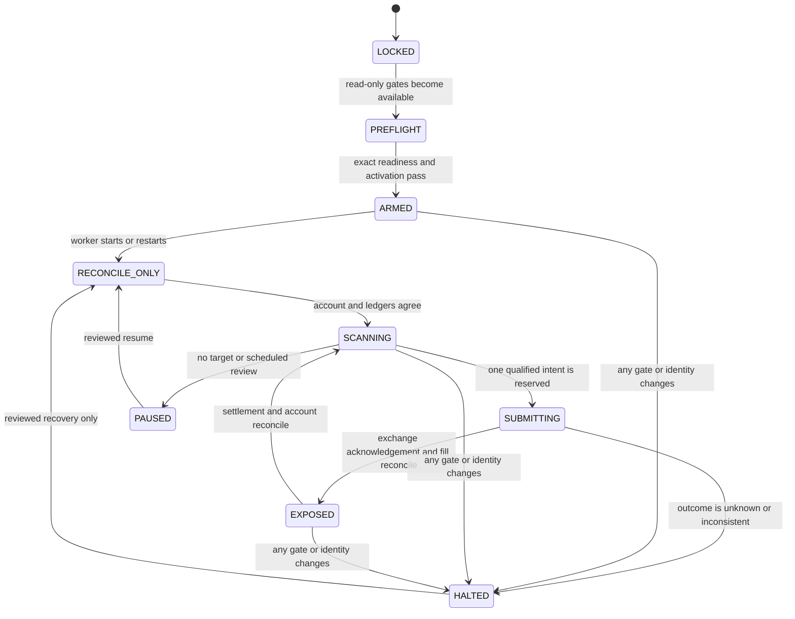

# Capital Canary Bot

This document owns the design and operating boundary for the repository's
small-capital weather-market canary. The campaign has a lifetime funding ceiling
of **$75**. It is intended to create high-quality execution and settlement
evidence while attempting slow capital growth; it is not evidence that the
current model beats the market.

The dashboard is read-only. It never grants authority, resolves credentials, or
submits an order.

## Current rollout state

The implementation is **capital locked**. As of 2026-07-21, the canonical
production-readiness gate reports `BLOCK / NOT_READY`, there is no verified
active production-capable release, and the current taker evidence is not
positive after costs. The capital gate in
[Item 321](../roadmap/items/item-321-model-production-readiness-evidence-integrity-and-staged-release-program.md)
therefore forbids credential access, authenticated submission, and capital
exposure.

User authorization to pursue a $75 canary does not replace the repository's
release, evidence, account, control, and exact-activation gates. Until all of
them pass, supported commands and tests stop at read-only preflight, fixture
execution, ledger validation, and dashboard projection.

## Safety boundary

The live canary is a new subsystem. It does not reinterpret a paper fill as an
exchange fill and does not make `safe_bets` an order-authority surface.

- The paper taker remains the owner of simulated candidates and fills.
- The production-readiness gate remains classification-only; it never grants
  credential or order authority, even when its highest stage is
  `CAPITAL_CANARY`.
- A separate, self-hashed activation must match the exact release, manifest,
  platform, redacted account identity, market allowlist, $75 ceiling, risk
  policy, reviewer, and expiry.
- Every submission must revalidate activation, readiness, release identity,
  account reconciliation, market metadata, input freshness, exchange
  economics, qualified edge, and risk.
- The readiness artifact must have its canonical schema and self-hash, preserve
  its classification-only/no-authority contract, and be no more than 15
  minutes old.
- There are no force, bypass, or "trade anyway" options.
- An unknown submission result, external order, stream gap, identity drift,
  reconciliation mismatch, or risk breach halts new placement. Restart always
  enters reconcile-only state and never automatically resumes capital.

No component collects, infers, stores, or displays geographic-location data.
This is not permission to bypass any restriction enforced by an exchange or
account provider.

## Authority state machine



`LOCKED`, `PREFLIGHT`, `PAUSED`, and `HALTED` cannot submit. `ARMED` only
permits a reconcile-only worker start. `SCANNING` may create an intent, but the
final order gate runs again immediately before `SUBMITTING`.

## $75 risk envelope

The immutable campaign funding ceiling is $75. There is no automatic top-up.
External deposits, withdrawals, unknown positions, or wallet balance drift
block placement until reviewed and reconciled.

### Lifecycle probe

The first stage is operational evidence, not alpha evidence:

- maximum all-in loss per order: $0.50;
- maximum one order per day and one unresolved order or position;
- maximum unresolved loss: $1.00; and
- five clean acknowledgement, cancellation/fill, account, and restart
  reconciliations before the alpha canary can be considered.

If the venue's minimum order is larger than the cap, the decision is
`VENUE_MINIMUM_EXCEEDS_RISK_CAP`; size is never rounded up to force a trade.
The current sub-dollar caps may therefore be non-executable on markets whose
minimum is one or more shares. That is an intentional capital lock, not a
reason to widen the policy from an API example. Any supervised one-minimum-lot
exception requires exact live market metadata and a separately reviewed,
versioned activation-bound policy.

### Alpha canary

After the lifecycle stage and all evidence gates pass:

| Control | Hard limit |
| --- | ---: |
| All-in worst-case loss per order and event | $0.75 |
| New risk per day | $1.50 and at most 2 trades |
| Correlated-regime unresolved risk | $1.50 |
| Total unresolved worst-case loss | $3.00 |
| Concurrent unsettled positions | 4 |
| Daily realized-loss halt | $1.50 |
| Rolling seven-day drawdown halt | $3.75 |
| Permanent canary drawdown halt | $15.00 or equity at/below $60 |

Three consecutive settled losses require review. Filled binary positions are
not automatically liquidated when placement halts; order cancellation and
position disposition are separate, auditable decisions.

Before credible live skill exists, Kelly size is zero and only the explicitly
authorized lifecycle micro-size is available. Later alpha size is the lesser
of 10% full Kelly and 1% of the risk basis, still bounded by every hard cap.
Losses reduce the risk basis immediately. Only 25% of positive cumulative
settled profit may expand it:

```text
risk_basis = min(reconciled_equity,
                 75 + 0.25 * max(0, cumulative_settled_net_profit))
```

No size increase is allowed before at least 20 live settled positions across
10 independent target dates and a nonnegative date-clustered after-cost 95%
lower confidence bound.

## Candidate and order gates

The first alpha lane is YES-buy only, one opinion per mutually exclusive
event-day. It excludes fades, NO orders, tail-lottery sizing, adjacent-band
stacking, repeated-snapshot entries, weak input slots, and untrusted current
highs until each has separate capital-grade evidence.

Every entry requires all of the following:

1. Executable ask from 0.85 through 0.97. A price above 90% is market consensus,
   not proof of edge.
2. A predeclared, whole-date out-of-sample fair-value lower bound with at least
   14 independent target dates and a positive date-clustered lower bound versus
   both the market and no-trade benchmarks.
3. Fair-value lower bound minus executable ask, live fee, and conservative
   slippage of at least $0.02 per share, with expected after-cost ROI of at
   least 2%.
4. Exact production release, snapshot, policy, permission, exchange-economics,
   and source-lineage hashes; valid WU cutoff and fresh trusted inputs.
5. A direct book refresh no more than two seconds before submission, spread no
   wider than one cent, order no larger than 10% of the top ask, valid current
   tick/minimum, and at least ten minutes until exchange close.
6. A marketable FOK limit with a hard maximum price. No unlimited market order,
   resting GTC order, averaging down, leverage, or blind retry is permitted.

The risk engine sizes YES shares. The current exchange interface expresses an
immediate FOK BUY as a dollar amount with a worst-price bound. A future adapter
must convert the approved share quantity to that request unit, re-estimate the
entire fill against the fresh book, and prove both the share and all-in dollar
caps immediately before signing. It must never pass a share count as dollars
or infer the order unit from a field name.

Raw market probability, raw model probability, calibrated out-of-sample fair,
its lower bound, market-shrunk fair, and executable after-cost edge remain
separate fields in the ledger and UI.

## Persistence and reconciliation

Canonical capital evidence lives under `data/live_taker_canary/`, separate from
`data/taker_runs/` and market-making tapes.

- `activation.json`: self-hashed exact authority scope; contains no secret.
- `decision_tape.jsonl`: every evaluated candidate and no-trade reason.
- `order_intents.jsonl`: hash-chained write-ahead intents and reservations.
- `submission_receipts.jsonl`: redacted request hashes and exchange IDs.
- `order_events.jsonl`, `fills.jsonl`, `cash_ledger.jsonl`,
  `settlement_events.jsonl`, `reconciliation.jsonl`, and `risk_events.jsonl`:
  append-only evidence.
- `status.json`, `positions.json`, and `portfolio.json`: atomic, self-hashed
  projections with sequence and ledger high-water marks.

One process owns a campaign lock. An idempotency key binds platform, redacted
account identity, event, token, side, price, quantity, release, input snapshot,
policy, and sequence. The intent is durably recorded before the network write.
An uncertain response is reconciled through private-stream and REST evidence;
the bot never resubmits blindly.

Placement freezes and cancel-all reconciliation starts on any unknown order,
acknowledgement timeout, unexpected partial fill, authentication/signature
fault, stream disconnect, repeated server error, clock drift, one-cent or
one-lot account mismatch, stale input, fee/slippage breach, identity change, or
risk breach. Zero open orders must be independently proven; a cancellation
response alone is not proof.

## Secret handling and exchange adapter

`.env` is ignored local secret material. Secret values are never read by the
dashboard, written to artifacts, passed on the command line, committed, or
included in errors. The capital-locked implementation does not resolve them at
all. Once the capital gate opens, a process-boundary resolver may expose only
named environment references to an authenticated adapter after the exact
activation and read-only preflight pass.

The repository currently mixes Global discovery with US-labeled exchange
economics, so the exact platform/account contract must be resolved before an
adapter is selected. The adapter will be behind a narrow protocol with
no-network and fixture implementations. Its official SDK version must be
pinned and re-reviewed at activation time; no beta or legacy client is silently
substituted.

Exchange assumptions were last checked on 2026-07-21 against the official
[orderbook](https://docs.polymarket.com/trading/orderbook),
[order lifecycle](https://docs.polymarket.com/trading/orders/overview),
[fee](https://docs.polymarket.com/trading/fees), and
[Python SDK](https://docs.polymarket.com/dev-tooling/python) documentation.
The contract deliberately re-queries each market's minimum order, tick, depth,
and fee parameters instead of treating examples or category defaults as live
truth.

## Read-only homepage

The overview route remains titled **Safest bets right now** and becomes the
capital-canary tracker. It displays:

- `LOCKED`, `PREFLIGHT`, `PROBE`, `LIVE`, `PAUSED`, or `HALTED`, exact UTC
  heartbeat age, kill switch, reconciliation state, and activation expiry;
- reconciled net liquidation value, cash, reserves, unresolved worst-case
  loss, settled and executable mark-to-market P&L, fees, drawdown, and cap
  utilization;
- bot-evaluated targets and hold reasons, never manual trade controls;
- last-known orders and positions, with stale data explicitly labelled
  **not assumed flat**;
- lifecycle, acknowledgement, fill, cancellation, settlement, and risk events;
- performance versus captured market-following and no-trade counterfactuals;
  and
- exact release, account-redaction, platform, policy, economics, permission,
  snapshot, code, schema, hash, and high-water provenance.

Unknown account values are `null`, never zero. Stale authority hides targets
and order-enabled claims but preserves last-known risk. Settled realized P&L
and executable-bid unrealized P&L are never blended without labels.

## Capital-locked commands

Run these from the repository root with the project interpreter:

```powershell
# Inspect current inputs without writing runtime state.
.\venv\Scripts\python.exe -m weather.market.live_taker_canary status

# Atomically materialize the read-only tracker status.
.\venv\Scripts\python.exe -m weather.market.live_taker_canary initialize

# Return a nonzero exit while capital cannot be submitted.
.\venv\Scripts\python.exe -m weather.market.live_taker_canary preflight
```

None of these commands implicitly loads `.env`, resolves a credential, contacts
an exchange, creates an order, or provides an activation bypass. Operator-
supplied artifact paths are read only as bounded strict JSON. `initialize` is
idempotent and writes only the derived capital-locked `status.json` projection.
All `.env*` paths and symlinked inputs/outputs are explicitly refused.

## Implementation and acceptance order

1. Capital-lock contract, pure risk math, state machine, append-only fixture
   ledger, bounded status projection, and tests.
2. Read-only homepage and explicit blocker/audit presentation.
3. Capital-grade model permission, platform identity, release/evidence, and
   exact activation artifacts.
4. Authenticated adapter, private-stream reconciliation, cancel-all/dead-man,
   and metered lifecycle tests only after Item 321 permits credential access.
5. Five supervised micro lifecycle probes, then an independent review before
   any alpha canary.

No live trade is accepted as complete unless every gate passes for the exact
submission, the resulting exchange and account state reconcile, the settlement
is linked to the canonical WU label, and the evidence remains reproducible
without secret material.
