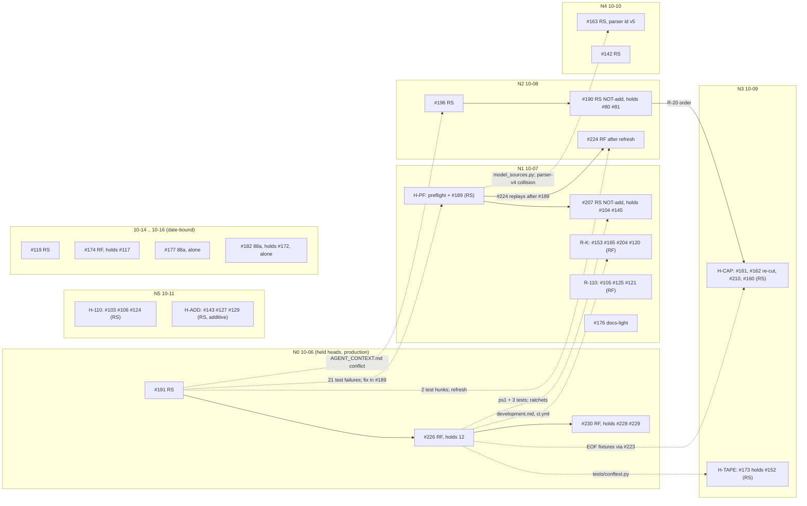

# Swarm L: landing backlog review (2026-10-05)

Status: dated research report for Swarm L (backlog and landing speed), written on the workstation on 2026-10-05
against `origin/master` @ `8e179f18`. It is historical evidence, not policy. Nothing in it changes a rule, closes a
PR or schedules a landing: every policy option is a proposal, the close list is a list for the owner, and the
"until 12:00" diff in section 8 is a proposal that production owns. Today's state lives in
[STATE_OF_PLAY](../../operations/STATE_OF_PLAY.md). Read this when you need to know why a PR is on the close list,
which night the calendar gave it, or what the owner was asked to decide on 2026-10-05.

Sources. Every number cites the swarm file it comes from, as `l-data/<role>/<file>`. `l-data` is
`C:\wt\workstation-chat\l-data\` on the workstation: it is outside the repository and not durable, so this report
carries the numbers that matter. Production figures come from the three relayed batches
(`l-data/production-data-batch{1,2,3}.md`), cited as B1, B2 and B3 with their item ids. Where the Defender verdicts
(`l-data/od/verdicts.md`, "OD") or the owner decision list (`l-data/a2/owner-decisions.md`, "A2") correct an earlier
card, the correction is used and named.

## 1. Verdict

**The night is bound by idle time between landing units, not by lease capacity.** On every one of the 11 nights
with receipts since 09-24 the shared lease was used at most 22 % of its 510-minute window; on the best night (10-05)
400 lease minutes were idle (`l-data/timing/timing-model.md` §0, §3). On 10-05 a 192-minute gap separated #217's
merge (01:23) from #213's suite (04:35), about 35 minutes of it a wait on a guessed 91a attempt name (B2 D5 and its
addendum).

- **Removing the idle (M1, no rule change) halves the drain.** The seed queue drains in 16 landing nights under
  current practice (17 with hold dates, last 10-22) and in 8 (12, last 10-17) with M1. M1 plus roll-sensitive
  batching (M7) reaches the hold floor of 10-16 (`l-data/timing/timing-model.md` §7).
- **The calendar already plans that way.** Packed back to back under the current rules and the M2 caps, the
  approved queue needs 9 landing nights (10-06..10-16): the undated queue drains by 10-11 and the rest is date-bound
  (10-14, 10-15, 10-16) (`l-data/calendar/calendar.md`, summary).
- **The backlog is smaller than it looks.** Of 83 open PRs, 24 are close-list rows (one of them, #86, recommended
  kept open) and 21 more close automatically when their containers land (section 4). The owner decides the close lines; the swarm closes nothing.
- **First-attempt failures are cross-PR traps, and a tool now finds them.** The landing preflight
  (`codex/landing-preflight-20261006`, section 9) refuses any conflict in the cumulative chain (including a
  generated-index-only one), selects the earlier PR's tests when a later PR is the head, and attributes ratchet
  failures to the PR that introduced them. Its dog-food runs flagged #189's missing `Guards:` lines and #207's
  conflict with #226 in under a minute each, before either reached the capture host.
- **Two owner decisions move the ceiling further**: M5 (the CI Windows lane plus the preflight replace the host suite
  for roll-free tips) and M6 (a signed merge train). The Defender rated both PILOT_FIRST (section 7).

## 2. Triage table

All 83 PRs open at the census (`l-data/r1/prs.json`, `gh` pass at 2026-10-05T14:53Z), plus #230, which opened
afterwards. Re-checked with `gh pr list` while this report was written: #212 has since merged into #181's branch
(10-05 17:42Z), and only #181 (`25f357bb` → `5b50a468`) and #207 (`3c38934c` → `e182beb0`) moved heads.

Column sources:

| Column | Source | Meaning |
| --- | --- | --- |
| roll | `l-data/r3/roll-<n>.json` | Expected class from the dated 95-file closure union (B1 D8) plus a static import graph: RS = roll-sensitive, RF = roll-free. `+add` = schema-additive, `NOT-add` = removes or changes `SchemaSpec` rows. A **prediction** (`binding: false`); the host `roll_verdict.ps1` binds. It reproduced all seven known host verdicts and all eight schema expectations (`l-data/r3/summary.md`) |
| containment | `l-data/r2/graph.json` | `in #n` = the exact head is an ancestor of open PR #n's head (minimal containers); `holds k` = k open PR heads are inside this one |
| vs master | `l-data/r4/conflicts.json` | `git merge-tree` against `8e179f18`, classed by the conflicting paths |
| pair conflicts | `l-data/r4/conflicts.json` | Conflicts with other PRs on two-parent synthetic commits (master + earlier, then the later head) |
| interactions | `l-data/r5/interactions.md` | Test failures that appear only on the cumulative tree, and their fix owner |
| approval | `l-data/r1/prs.json` | `owner` = a DECISION_LOG row approves the merge; `SoP queue` = STATE_OF_PLAY's critical path names it; `draft` = draft PR with neither; `none` = neither and not draft. PR text is evidence, not truth |
| disposition | `l-data/calendar/calendar.json`, `l-data/r7/close-list.json`, A2 | Calendar night and unit (section 5), close code (section 4), held head or parked reason |

Summary counts at the census:

| Measure | Count | Source |
| --- | --- | --- |
| Expected roll class | 52 RS, 31 RF, 0 undecidable | `l-data/r3/summary.md` |
| Against master | 27 clean, 56 conflicting: 31 index-only, 10 docs/CI/config, 8 real `src`, 4 real tests, 2 docs, 1 config | `l-data/r4/conflicts.json` `counts` |
| Approval class | 17 owner, 18 SoP queue, 46 draft, 2 none | `l-data/r1/prs.json` |
| Disposition (this table) | 31 scheduled N1–N10; 23 close rows plus #86 kept open; 18 auto-close only; 3 held; 5 parked; 2 owner questions; #212 merged into #181's branch | sections 4 and 5 |
| Whitespace-only (M13 class) | 0 of 83 | `l-data/r3/summary.md` |

Queue-set conflicts: 153 unordered pairs among the 18 PRs of the queue set; 11 conflict, 9 of them with a held head
(#191 or #226). Each is fixed in the later PR after the held head lands, never on the held head
(`l-data/r4/conflicts.json` `findings`).

| PR | title | head | base | roll (r3) | containment (r2) | vs master (r4) | pair conflicts (r4) | interactions (r5) | approval (r1) | CI | disposition |
| --- | --- | --- | --- | --- | --- | --- | --- | --- | --- | --- | --- |
| #78 | Build resilient owner-attended RE-1M reward t... | `7e6e1709` | orphan | RS NOT-add | in #85 | real-src | - | - | draft | red | CLOSE C5 (tag first) |
| #80 | Integrate parser v2 and preserve the historic... | `abd648c7` | master | RS NOT-add | in #190 | real-tests | - | - | draft | green | CLOSE C3 after #190 (A6/A7) |
| #81 | Integrate bulletin reuse with the historical... | `cee879c4` | #80 | RS NOT-add | in #190; holds 1 | real-src | - | - | draft | green | CLOSE C3 after #190 (A6/A7) |
| #82 | Collect RE-1 payout sources and report missin... | `045a100e` | #78 | RS NOT-add | in #85; holds 1 | real-src | - | - | draft | red | CLOSE C5 (tag first) |
| #83 | Link RE-1 reward payments under the reviewed... | `4bb04b68` | #82 | RS NOT-add | in #85; holds 2 | real-src | - | - | draft | red | CLOSE C5 (tag first) |
| #84 | Harden RE-1 preflight environment checks and... | `7010a0b5` | #83 | RS NOT-add | in #85; holds 3 | real-src | - | - | draft | red | CLOSE C5 (tag first) |
| #85 | fix: handle RE-1 complementary fills and repo... | `cd66451a` | #84 | RS NOT-add | holds 4 | real-src | - | - | draft | red | CLOSE C5 (tag first) |
| #86 | research: measure settlement truth after the... | `d53e280a` | master | RF | - | clean | - | - | draft | green | KEEP OPEN (C6 row; A25) |
| #96 | Add offline weather maker plugin and bounded... | `7d9e0b59` | master | RS +add | in #167, #175, #181, #212 | index-only | - | - | draft | green | CLOSE C3 (tag first) |
| #100 | Build maker replay harness with source-backed... | `98f768c7` | #96 | RS +add | in #137, #167, #175, #181, #212 | index-only | - | - | draft | green | CLOSE C3 (tag first) |
| #103 | 110m part 2: consolidate point-in-time artifa... | `d6fce554` | master | RS | - | index-only | - | - | draft | green | N5 10-11 H-110 |
| #104 | 110m part 3: move shared live helpers out of... | `b8c82799` | master | RS | in #207 | index-only | - | - | SoP queue | green | auto-closes via #207 |
| #105 | 110m part 4: contain suite temp files and rem... | `5c4c3f8d` | master | RF | - | docs-ci-config-only | - | - | draft | green | N1 10-07 R-110 |
| #106 | 110m part 5: enforce reviewed repository heal... | `0baf9306` | master | RS schema-noentry | - | index-only | - | - | draft | green | N5 10-11 H-110 |
| #107 | docs: add YouTube maker plugin template | `5fc4e7d4` | #100 | RS +add | - | index-only | - | - | draft | red | OWNER Q (A27) |
| #108 | docs: design the public-read maker shadow runner | `06a0bb31` | #100 | RS +add | in #137, #167, #175, #181, #212; holds 1 | index-only | - | - | draft | green | CLOSE C3 (tag first) |
| #109 | replay: freeze execution choices and implemen... | `066b0700` | #100 | RS +add | in #137, #167, #175, #181, #212; holds 1 | index-only | - | - | draft | green | CLOSE C3 (tag first) |
| #112 | Replay execution pack: clarified panel, calib... | `96bfef80` | #109 | RS +add | in #137, #167, #175, #181, #212; holds 2 | index-only | - | - | draft | green | CLOSE C3 (tag first) |
| #113 | market: add frozen T+1/T+2 fair-value reliabi... | `d937b34a` | #100 | RS +add | in #167, #175, #181, #212; holds 1 | index-only | - | - | draft | green | CLOSE C3 (tag first) |
| #114 | feat(replay): add nightly sealed city-bundle... | `481b3677` | #100 | RS +add | in #167, #175, #181, #212; holds 1 | index-only | - | - | draft | green | CLOSE C3 (tag first) |
| #115 | Implement public-only maker shadow runner and... | `b157c52a` | #108 | RS +add | in #137; holds 4 | index-only | - | - | draft | green | OWNER Q after #192 (A26) |
| #117 | Reuse settled work in Stage A (110v Part 2) | `9e8bbf5b` | master | RF | in #174 | index-only | - | - | owner | green | auto-closes via #174 |
| #118 | Throttle complete token batches by identity a... | `df686f4b` | master | RS | - | index-only | - | - | owner | green | PARKED: 88a, not before 10-30 (DL row 93) |
| #119 | Bound snapshot reads and cache forecast manif... | `1877ba36` | master | RS | - | index-only | - | - | owner | green | N8 10-14 H-119 |
| #120 | Add thin healthy ensure entry for snapshot an... | `3ccbaa8c` | master | RF | - | index-only | - | - | draft | green | N1 10-07 R-K |
| #121 | Add optional per-step Stage-A profiling with... | `2c6c7ad5` | master | RF | - | index-only | - | - | draft | green | N1 10-07 R-110 |
| #124 | 110o part 1: move generated event snapshot to... | `a6abf5fe` | master | RS | - | config | - | - | draft | green | N5 10-11 H-110 |
| #125 | 110o-2: schedule D1-09 evidence producers | `3770ea3f` | master | RF | - | index-only | - | - | draft | green | N1 10-07 R-110 |
| #127 | 110x: read-only manual order journal (owner-d... | `ebe72984` | master | RS +add | - | docs-ci-config-only | - | - | draft | green | N5 10-11 H-ADD |
| #129 | 110z part 1: read-only reward-opportunity sca... | `43c76b8a` | master | RS +add | - | real-tests | - | - | draft | green | N5 10-11 H-ADD |
| #133 | docs: 111b report — returned branches CI-green | `32e608ff` | master | RF | in #167, #175, #181, #212 | index-only | - | - | draft | green | CLOSE C3 (tag first) |
| #134 | Integration 2026-09-29/30: exam line (plugin,... | `77d0196b` | master | RS +add | in #167, #175, #181, #212; holds 7 | index-only | - | - | draft | green | CLOSE C4 (tag first) |
| #137 | 110w: one-sided-edge-v0 second candidate (fix... | `ad6646cc` | #115 | RS +add | holds 5 | index-only | - | - | draft | green | PARKED: owner deferred; after 10-15 |
| #142 | 110j C: compress token tapes on close; canoni... | `6c9456f3` | master | RS +add | - | docs-only | - | - | SoP queue | green | N4 10-10 H-142 |
| #143 | 111f: competitor-reaction and decidedness-lat... | `6a6f05ef` | master | RS +add | - | index-only | - | - | draft | green | N5 10-11 H-ADD |
| #144 | 111e: make the signed replay exam executable... | `8d91b4a0` | #134 | RS +add | in #167, #175, #181, #212; holds 8 | index-only | - | - | draft | green | CLOSE C4 (tag first) |
| #145 | 110o part 3: retire taker and paper-maker run... | `a5a1cce7` | master | RS NOT-add | in #207; holds 1 | real-tests | - | - | owner | green | auto-closes via #207 |
| #152 | fix: execution tape survives transient fsync... | `722b34b5` | master | RS | in #177 | clean | #220, #226 | - | SoP queue | green | N3 10-09 H-TAPE (with #173) |
| #153 | fix(ops): Stage B 06:45 trigger with source-d... | `972a5b80` | master | RF | - | index-only | - | - | draft | green | N1 10-07 R-K |
| #157 | Exam code tree: #144 (incl. #134) + weather m... | `664c8943` | master | RS +add | in #175, #181, #212; holds 10 | index-only | - | - | draft | green | CLOSE C4 (tag first) |
| #160 | Stop the MRMS S3 listing poll (owner 2026-10-... | `b8e4eef1` | master | RS | - | clean | #223, #226 | #223 EOF (item-79) | owner | green | N3 10-09 H-CAP |
| #161 | Toronto CYYZ/CYTZ NBM block retention flag (d... | `5fe93cd8` | master | RS +add | - | clean | - | own Guards | owner | green | N3 10-09 H-CAP |
| #162 | NBM: land 83b NBP cycle-level fan-out fix; ca... | `c80c34ea` | master | RS +add | - | clean | #210, #223, #226 | 3 interaction (#223 EOF fixtures); 2 head | owner | green | N3 10-09 H-CAP (re-cut, R-20) |
| #163 | METAR item 4: 2-min METAR/SPECI first-seen le... | `30ea6e6e` | master | RS +add | - | clean | #189, #224 | src conflict model_sources.py; Guards; parser-id v4 to v5 (R-19) | owner | green | N4 10-10 H-163 |
| #165 | T+1 Amendment 3: reported-only NWP-availabili... | `bf03a8d4` | master | RF | - | clean | - | - | draft | green | N1 10-07 R-K |
| #166 | Pull-cap precheck: report, read-only tool, un... | `04a98733` | master | RF | in #181, #212 | index-only | - | - | none | green | CLOSE C4 (tag first) |
| #167 | Exam dry-run harness: W2 runbook end to end a... | `2b23b2da` | orphan | RS +add | holds 10 | docs-ci-config-only | - | - | draft | green | CLOSE C4 (tag first) |
| #168 | Replay memory: profile, byte-identical protot... | `dd4da634` | orphan | RS +add | in #175; holds 10 | index-only | - | - | draft | green | CLOSE C4 (tag first) |
| #172 | 88a capture families: lowest-temperature (11... | `d01d7ce1` | master | RF | in #182 | index-only | - | - | SoP queue | green | auto-closes via #182 |
| #173 | Execution tape: keep the trade socket reading... | `96e22678` | master | RS | in #177; holds 1 | index-only | - | - | SoP queue | green | N3 10-09 H-TAPE (hold lifts, C6) |
| #174 | DO NOT MERGE BEFORE 10-14: Drive decision 4 —... | `f8471f43` | master | RF | holds 1 | docs-only | - | - | SoP queue | green | N8 10-14 R-174 |
| #175 | Replay streaming: STOP at ~120 bands — runtim... | `d8373323` | #168 | RS +add | holds 12 | index-only | - | - | draft | green | CLOSE C4 (tag first) |
| #176 | Maker replay v2: successor registration DRAFT... | `4bbce397` | master | RF | in #181, #212 | clean | - | - | owner | green | N1 10-07 D-176 |
| #177 | 88a maker evidence: keep the public stream so... | `4518a49a` | master | RS | holds 2 | clean | #220, #226 | - | owner | green | N9 10-15 H-177 |
| #180 | maker_core: enforce pause and bleed limit bef... | `43fb1288` | master | RS +add | in #192 | clean | - | - | SoP queue | green | PARKED: owner release; lands with #192 |
| #181 | DO NOT MERGE BEFORE SIGNATURE | `25f357bb` now `5b50a468` | master | RS +add | holds 13 | real-src | - | - | draft | none | PARKED: DO NOT MERGE BEFORE SIGNATURE (v2) |
| #182 | Capture families in status.ps1 and the cockpi... | `c4f3a551` | #172 | RF | holds 1 | index-only | - | - | SoP queue | green | N10 10-16 H-182 |
| #189 | M0: key METAR rows on obsTime, not nominal re... | `8cde625e` | master | RS | in #224 | clean | #163 | 21 interaction after #191; Guards (fix owner #189) | SoP queue | green | N1 10-07 H-PF (with preflight) |
| #190 | NBM parser v2 landing (83a/83b/83d) + v1-shad... | `97848089` | master | RS NOT-add | holds 2 | real-tests | - | #223 EOF fixtures; drops duplicate 83b work vs #162 | SoP queue | green | N2 10-08 H-190 |
| #191 | model: restore evening late-day lock-in on ca... | `a08e9890` | master | RS | - | clean | #196, #224 | - | owner | green | HELD @a08e9890; N0 10-06 |
| #192 | maker_core: public-reads-only maker shadow ru... | `b31185d6` | master | RS +add | holds 1 | clean | - | - | SoP queue | green | PARKED: owner release (holds #180) |
| #196 | fix(model): METAR fetch window measured in UT... | `6f86b67c` | master | RS | - | clean | #191 | 1 head Guards; AGENT_CONTEXT union | owner | green | N2 10-08 H-196 |
| #197 | ci: upload Linux JUnit results as an artifact... | `bc78abc8` | master | RF | - | clean | #220, #226 | empty diff after #226 | draft | green | CLOSE C3 after #226 (tag first; A23) |
| #199 | tests: quarantine marker for staged cuts (tes... | `344e3c9f` | master | RF | in #226 | docs-ci-config-only | - | - | SoP queue | green | auto-closes via #226 |
| #200 | ci: ratchet marker; ratchets run once in the... | `306361e6` | master | RF | in #226 | docs-ci-config-only | - | - | SoP queue | green | auto-closes via #226 |
| #201 | tests: shared PowerShell host for non-process... | `759d5e1d` | master | RF | in #226 | clean | - | - | SoP queue | green | auto-closes via #226 |
| #202 | tests: git template fixture, cached reconcile... | `f218b40f` | master | RF | in #226 | clean | - | - | SoP queue | green | auto-closes via #226 |
| #203 | ops/ci: time-packed bounded-suite chunks and... | `1976bb9d` | master | RF | in #226 | docs-ci-config-only | - | - | owner | green | auto-closes via #226 |
| #204 | tools: affected-test selection from the impor... | `706223d2` | master | RF | - | clean | #220, #226 | 2 head ratchets (Guards, spawns) | draft | green | N1 10-07 R-K |
| #207 | #145: keep the paper-live-forward tool per DE... | `3c38934c` now `e182beb0` | #145 | RS NOT-add | holds 2 | clean | #220, #226 | 3 head ratchets after #226 | owner | red at census; green at `e182beb0` | N1 10-07 H-207 (merged last) |
| #209 | ci: Windows lane for Windows-only tests no CI... | `efea7692` | #203 | RF | in #226; holds 1 | docs-ci-config-only | - | - | owner | green | auto-closes via #226 (close by hand, A24) |
| #210 | Fan-out: treat Windows O_EXCL claim denial as... | `624af5db` | master | RS | - | clean | #162 | fanout.py union; 3 inherited from #190 | owner | green | N3 10-09 H-CAP |
| #212 | maker replay v2 W2: bundle v0.2 exporter (S2... | `024b9797` | #181 | RS +add | holds 13 | real-src | - | - | none | green | MERGED into #181's branch 10-05 17:42Z (lands via #181) |
| #216 | tests: execution twins for quiet_window_merge... | `e98099a3` | master | RF | in #226 | clean | #220 | - | SoP queue | green | auto-closes via #226 |
| #218 | test: CI-only deadline scale for the reconcil... | `2b4a6c40` | #209 | RF | in #226; holds 2 | docs-ci-config-only | - | - | owner | green | auto-closes via #226 (close by hand, A24) |
| #219 | ci: run memory-flatness tests in a parallel j... | `8d359668` | master | RF | in #226 | docs-ci-config-only | - | - | SoP queue | green | auto-closes via #226 |
| #220 | integration: roll-free K batch (#199, #200, #... | `764d73b9` | master | RF | in #226; holds 8 | clean | #152, #177, #197, #204, #207, #216, #229 | - | draft | green | auto-closes via #226 |
| #222 | ops: fix $PSScriptRoot param defaults under P... | `d29a41b5` | master | RF | in #226; holds 1 | docs-ci-config-only | - | - | SoP queue | green | auto-closes via #226 |
| #223 | audit: reject trailing blank lines at EOF in... | `714e2697` | master | RF | in #226 | clean | #160, #162 | - | draft | green | auto-closes via #226 |
| #224 | backtesting: combined METAR v4 re-parse + loc... | `59d99fb5` | master | RS | holds 1 | clean | #163, #191 | refresh onto #191 a08e9890 | draft | green | N2 10-08 R-224 |
| #226 | integration: roll-free batch 2026-10-06 (#220... | `a194b6a3` | master | RF | holds 12 | clean | #152, #160, #162, #177, #197, #204, #207, #229 | - | draft | green | HELD @a194b6a3; N0 10-06 |
| #228 | tests: deterministic timing for the ctrl-brea... | `05b1a4e8` | master | RF | - | clean | - | - | draft | green | auto-closes via #230 |
| #229 | live launcher: start the PowerShell child wit... | `08e90b6c` | master | RF | - | clean | #220, #226 | - | draft | pending | auto-closes via #230 |
| #230 | integration: rf2 on #226 (#228, #229) | `55ed5c3e` | master | RF (host verdict) | holds #226, #228, #229 | not in census | - | #228 ctrl-break flake (R-22) | draft | green | HELD @55ed5c3e; N0 10-06 after #226 |

## 3. Dependency graph

Trimmed to the landing queue: each subgraph is a planned night, solid arrows are landing order, and dotted arrows are
a conflict or test interaction that the later PR must fix. The full 83-node graph with every containment edge is
`l-data/r2/graph.mmd` (173 lines).



Not on the graph: the parked PRs (#181 holding 13 heads, now including the merged #212; #180 inside #192; #118;
#137 stacked on #115; #86; #107) and the close-list rows (section 4).

## 4. Close list (corrected)

The L-R7 list (`l-data/r7/close-list.md`) with the Defender's conditions applied (OD §2) and the owner list's
numbering (A2 §A). The swarm closes, tags and deletes nothing. Every close follows one rule: push the annotated tag
`archive/pr-<n>-<sha8>` on the exact head first, then close; branch deletion is never proposed. The exact tag
commands are in `l-data/r7/close-list.json`.

Corrections applied:

- **#197 added** (OD §2.4, R-21). Head `bc78abc8` has one commit on neither master nor #226, and
  `merge-tree a194b6a3 bc78abc8` conflicts in `ci.yml` and `docs/development.md`, so it is not an auto-close. Class
  C3, superseded in substance by #226 (#226's `ci.yml` says it uses the "same artifact contract as PR #197"). Tag
  `archive/pr-197-bc78abc8` first, then close by hand after #226 lands.
- **Container SHAs refreshed** (OD §2.2): #181 `25f357bb` → `5b50a468` (still holds the 12 exam rows) and #207
  `3c38934c` → `e182beb0` (still holds #104 and #145). #167, #168 and #175 are still not inside #181, so their tags
  are mandatory (A2, re-proved at 18:12Z).
- **The exam tag exists** (R-14): origin holds the annotated `evidence/exam-maker-replay-2026-10-15-664c8943`
  (tag object `040c4ee5` → `664c8943`). L-R7's "origin has no tag" text for #157 is stale;
  `archive/pr-157-664c8943` is optional, kept only for uniform naming.

| A2 line | PR | Code | Head | Tag before close | When | Proof |
| --- | --- | --- | --- | --- | --- | --- |
| A1–A5 | #78, #82, #83, #84, #85 | C5 RE-1 retired (also C7 orphaned stack) | `7e6e1709`, `045a100e`, `4bb04b68`, `7010a0b5`, `cd66451a` | `archive/pr-78-7e6e1709`, `-82-045a100e`, `-83-4bb04b68`, `-84-7010a0b5`, `-85-cd66451a` | now (decided 09-25 and 09-27, "closes 10-01"; overdue) | #78–#84 each `--is-ancestor` of #85 `cd66451a`; DECISION_LOG lines 45 and 62 |
| A6 | #80 | C3 superseded by #190 | `abd648c7` | `archive/pr-80-abd648c7` only if closed before #190 lands | after #190 (auto-marks merged) | `--is-ancestor abd648c7 97848089` = 0 |
| A7 | #81 | C3 superseded by #190 | `cee879c4` | `archive/pr-81-cee879c4` only if closed before #190 lands | by hand after #190 (its base is #80's branch) | `--is-ancestor cee879c4 97848089` = 0 |
| A8–A17, A19 | #96, #100, #108, #109, #112, #113, #114, #133, #134, #144, #166 | C3/C4: exam v1 closed NOT EXECUTED; bytes exact in #181 | per row in `close-list.json` | `archive/pr-<n>-<sha8>` each | now | exact containment in #181 `5b50a468`; DECISION_LOG lines 99 and 103 |
| A18 | #157 | C4 | `664c8943` | evidence tag exists; archive tag optional | now | R-14 |
| A20–A22 | #167, #168, #175 | C4 with unique work (not in #181) | `2b23b2da`, `dd4da634`, `d8373323` | mandatory | now; do not carry into v2 unless v2 needs it | `--is-ancestor <head> 5b50a468` = 1; DECISION_LOG line 97 cites #175's measurement |
| A23 | #197 | C3 superseded in substance by #226 | `bc78abc8` | `archive/pr-197-bc78abc8` | by hand after #226 lands | OD §2.4 |
| A24 | #209, #218 | landed inside #226 (stacked bases) | `efea7692`, `2b4a6c40` | none (on master by then) | by hand after #226, quoting the landing merge SHA (master-agent, R-17) | `l-data/r7/close-list.md` C2 table |
| A25 | #86 | C6, **keep open** | `d53e280a` | `archive/pr-86-d53e280a` if ever released | re-ask at the 10-31 review | DECISION_LOG line 45 ("#86 … stay open") |
| A26 | #115 | owner question | `b157c52a` | `archive/pr-115-b157c52a` | after #192 lands | no containment; #192 replaces named pieces only |
| A27 | #107 | owner question | `5fc4e7d4` | `archive/pr-107-5fc4e7d4` | now, unless the YouTube plugin template is still wanted | no containment; CI red; stacked on #100 |

Auto-closes needing no owner action (A28; the `l-data/r7/close-list.md` C2 table, re-proved by OD §2.2): #199–#203,
#216, #219, #220, #222 and #223 inside #226; #228 and #229 inside #230; #104 and #145 inside #207 (#207 itself is then
closed by hand, its base being #145's branch); #152 and #173 inside #177 if #177 lands first; #172 inside #182; #117
inside #174. #137 stays held (A29). Held heads are never listed: #191 @`a08e9890`, #226 @`a194b6a3`,
#230 @`55ed5c3e`.

## 5. Landing calendar

`l-data/calendar/calendar.md` (L-R6, generated 17:54Z), with production's decisions R-23..R-26
(`l-data/COORDINATION.md`) applied. Times are local and modelled: 91a at its 33-minute planning value, unit = suite
46.5 + 0.5 + merge 5.25 minutes. A slot is a landing slot only with a 40-hex SHA (R-3); most heads change before they
land, so the plans are regenerated every morning from receipts. Each night is a `landing_night_plan_v0.1` JSON with a
`plan_sha256` (`l-data/calendar/night-<date>.json`).

| Night | RS heads (01:03–03:39) | RF heads (lease 00:30–09:00) | Other | Lease use |
| --- | --- | --- | --- | --- |
| N0 10-06 (fixed by production) | #191 `a08e9890` | #226 `a194b6a3`; #230 `55ed5c3e` (held, R-22) | docs closeout 09:00 | 189 / 510 min (37 %) |
| N1 10-07 | **H-PF = preflight + #189** (R-23); then the #207 stack `e182beb0`, merged last (R-24) | R-K: #153, #165, #204, #120; R-110: #105, #125, #121 | #224 acceptance replay 03:45–05:55; #176 docs-light | 371 / 510 (73 %) |
| N2 10-08 | #196; then the #190 stack, merged last (R-24) | #224 after its refresh | — | 189 / 510 (37 %) |
| N3 10-09 | H-CAP: #161, #162 re-cut, #210, #160; H-TAPE: #173 holding #152 | — | — | 137 / 510 (27 %) |
| N4 10-10 | #163 (parser id v5); #142 | — | — | 137 / 510 (27 %) |
| N5 10-11 | H-110: #103, #106, #124; H-ADD: #143, #127, #129 | — | — | 137 / 510 (27 %) |
| N8 10-14 | #119 | #174 holding #117 | — | 137 / 510 (27 %) |
| N9 10-15 | #177 (88a, alone) | — | — | 85 / 510 (17 %) |
| N10 10-16 | #182 holding #172 (88a, alone) | — | — | 85 / 510 (17 %) |

From N1 every night keeps an unbooked RS retry slot, and from N2 an unbooked RF retry slot.

Production's decisions applied:

- **R-23: N1 is preflight + #189** in one roll-sensitive integration head. The preflight is roll-sensitive because
  registering its two schemas touches `schema_registry_recent_data.py`, which is in the live closure (R-6, R-15;
  `l-data/pd/verdict.md` item 9). Fallback if #189's fix is not CI-green at the head cut-off: preflight + #161 +
  #160. No M2 waiver for #207: the suggested #104 → #145 + #207 pairing would put a NOT-additive schema change and
  107 `src` files into the head (`l-data/calendar/calendar.json` `pairing`).
- **R-24: #207 and #190 each share a night** with one other RS head and merge last, instead of AGREED's own night
  for #207.
- **R-25: the #173 hold lifts** (A2 C6). `git diff origin/master...96e22678` touches the public execution tape
  (`market/execution_tape_capture.py`, `_io.py`, `_store.py`, the new `execution_tape_disconnects.py`),
  `tests/conftest.py` and docs, and no 88a module; DECISION_LOG row 102 names the 88a hold set as #118, #172, #177
  and #182. #173 still changes live capture code, so it stays **roll-sensitive**: it lands in the quiet window via
  `quiet_window_merge.ps1`, with the verdict from `roll_verdict.ps1`. It needs the `conftest.py` union and an index
  regeneration after #226, and its own "DO NOT MERGE BEFORE 2026-10-14" text must be updated or overridden by the
  owner.
- **R-26: approvals.** #224 is approved (#189's acceptance replay). #204 is approved if it implements an
  owner-approved K follow-up, and it does: K role 12, the impact-selection builder behind K policy P2 (A2 D2). #129,
  #153, #165, #120 and #121 go to the owner (section 10, D3–D7).
- **R-19: #189 keeps `metar-parser-v4`; #163 takes `metar-parser-v5`** and lands after #189 (N4), with a mislabel
  check first (section 8.5).
- **R-20: #190 → #162 → #210.** #162 is re-cut on a new branch from master after #190 lands, so it no longer
  re-carries #190's work; nobody rebases or force-pushes #162's branch.

Open against the calendar: the owner list recommends **parking #165** (A2 D5: the read it serves was postponed). If
the owner agrees, R-K drops to #153, #204 and #120. The refresh and interaction-fix tasks per PR, each with its fix
owner, are in `l-data/calendar/refresh-tasks.md`.

## 6. Timing model

`l-data/timing/timing-model.md` (L-N1), parameters with provenance in `l-data/timing/params.json` v0.3, and the
deterministic simulator `l-data/timing/night_model.py`. The simulator reproduces 10-05 to within 2 minutes
(utilization 0.215 modelled vs 0.216 actual) and the 09-25/09-26 merge times (§4).

| Parameter | Value | Source |
| --- | --- | --- |
| Lease window | 00:30–09:00, serial | `workload_admission.ps1:597-599` |
| Bounded suite | 46.5 min wall; chunks 2,750 s (#217 `a96fc469`) and 2,774 s (#213 `1b319d50`) | B3 A13; B1 D4 |
| Chunk 13 (reconciler file) | 1,585–1,588 s = 58 % of chunk time | BRIEF; timing §1 |
| Guarded merge | 5 m 15 s = 2 s + **300 s fixed settle** + 1 s + 10 s push | B2 D3 |
| Supervisor ticks | PT1M–PT2M, so the 300 s settle is 2.5–5× the readoption floor | B3 A12 |
| 91a | 0–3, 33–34 or 73 min (the 73-min night reclaimed 21.3 GB) | B1 D1 |
| Replay | 130 min | BRIEF |
| Gap between units | 192 and 18 min on 10-05 | B2 D5 |

Where the night goes (`timing-model.md` §3):

- **The lease was idle at least 78 % of the window on every night since 09-24.** The best night, 10-05, was 21.6 %
  used: 110 busy minutes of 510. Within busy minutes the suite is 85 % (chunk 13 about half of it) and the settles
  13 %.
- The 09-30..10-03 idle was mostly policy (the exam-period freeze, lifted 10-03), not latency (§8 F-4).
- On 09-25 and 09-26 six single-PR guarded merges a night landed in about 30 lease minutes with no host suite (B3
  A15, A18). That is practical evidence for M5- and M13-style landings, not safety evidence: no outcome comparison
  against a suite exists for those 12 merges.

Capacity per night (`timing-model.md` §5, t_91a 33): 1 RS + 1 RF head at the 10-05 gap; 2 RS + 5 RF at a 10-minute
gap. A third RS head at a 2-minute gap starts its merge at 03:39, a 1-minute margin, so the planning value is
**2 + 5** (the OD M1 correction of the earlier 3 + 5 headline).

Nights to drain the seed queue (`timing-model.md` §7, capacity only / with hold dates):

| Scenario | Nights | Last night |
| --- | --- | --- |
| Current, as operated (gap 192 min) | 16 / 17 | 10-22 |
| M1 remove the idle (gap 2 min) | 8 / 12 | 10-17 |
| M7 RS batching alone | 9 / 13 | 10-18 |
| M1 + M7 | 5 / 11 | 10-16 (the hold floor) |
| M1 + M2 + M3 + M7 (no-decision items and written defaults) | 5 / 11 | 10-16 |

Hypotheses (§6): settle ≥ 94 % of merge time CONFIRMED (300 of 313 s); suite variance < 5 % SUPPORTED (0.9 %,
n = 2); chunk 13 = the reconciler file PARTLY SUPPORTED; throughput is latency-bound SUPPORTED. The tiering tasks take
the shared lease at 05:00 and 06:00 and returned 0 on 10-05 although #213 held the lease across 05:00 (B3 A11).
Whether they wait or skip is open; a hard-tiering sensitivity costs 2–3 RF heads a night.

## 7. Policy options M1–M13

Full text with mechanism, saving, incident references and evidence tables: `l-data/o1/options.md` (L-O1). The
verdicts are the Defender's (`l-data/od/verdicts.md`), which override L-O1's design verdicts where they differ.
Nothing has been changed.

| id | Option | OD verdict | Conditions |
| --- | --- | --- | --- |
| M1 | Remove the inter-unit idle: heads built and preflighted the day before, the next unit gated on lease or Scheduler state | **RECOMMEND** (practice only) | Plan 2 RS + 5 RF heads, not 3 + 5. Gate on lease state or the task's `LastRunTime` plus its status artefact, never on a guessed attempt name or a bare exit code |
| M2 | Integration-branch default with caps | **RECOMMEND** | The cap must read "≤ 4 PRs **and** ≤ 30 `src` files" (L-O1's "or" lets a 12-PR head through); ≤ 1 serving change; homogeneous class; no NOT-additive schema or 88a change mixed in; newly built heads only (held #226 is not re-cut) |
| M3 | Preflight receipt in the handback plus a docs-transaction pre-check; unchanged reviews bound to the night's final tip | **RECOMMEND** receipt and pre-check; **PILOT_FIRST** the binding change | The binding change ships with a no-relaxation test: a night whose later integration moves STATE_OF_PLAY must still fail without a review bound to the final tip |
| M4 | Three findings (sections 8.1–8.3): the 12:00 text, `push_terminal_proved`, the lease journal | **RECOMMEND** | All byte changes to `quiet_window_merge.ps1` (the M4 comment, the M4 field, the M8 shadow log) in **one** roll-free landing, last on its night, with no attempt registered and no reconciliation marker active; new attempts re-bound to the new hash. `status.ps1` is not edited (`register_health_watchdog.ps1:30/52` pins its hash). The journal records PID and creation time, fails open and rotates |
| M5 | CI Windows lane plus preflight replace the bounded suite for roll-free tips | **PILOT_FIRST** (shadow dual run) | Disqualify a tip that adds or changes a host-divergent test (Windows-only, in no CI shard, or touching identity, ACL or Scheduler APIs: the 10-04 `WORKGROUP\micha` class) or touches a hash-pinned script. "venv hash" = the host lock hash at the last passing host suite. Freshness = the merge-time `roll_verdict`. Adopt after the later of 5 concordant landings or 14 days; run the host-only test enumeration first |
| M6 | Merge train = the reviewed v1 queue for `merge_queue_driver.ps1` | **PILOT_FIRST** (dry driver, 3 nights) | The **owner** signs a git-committed artefact naming `plan_sha256` and every 40-hex tip; a relay is not an owner merge instruction. The 22:00 cut-off collides with the light path's before-12:00 rule. Fail-stop on any non-`pushed` outcome |
| M7 | RS batching under the M2 caps | **RECOMMEND** | One restart per head; an additive-only statement per member; 88a and serving changes alone |
| M8 | Event-based settle instead of the fixed 300 s | **PILOT_FIRST** (shadow log) | Keep `Start-Sleep 300` and log when the event rule would have exited. Roll-free tips first; RS tips keep 300 s until readoption-to-first-heartbeat timestamps exist. Rides the M4 hash-rebind landing |
| M9 | Cheaper chunk 13 (reconciler fixture steps 0/1) | **RECOMMEND** steps 0/1; **NOT_NOW** host `-n 4` | Keep per-case which-stage assertions (the K Defender conditions) |
| M10 | 91a-first vs suite-first nights (disk trade) | **NOT_NOW** | The only gain (the undated RS queue one night earlier) is absorbed by the 10-16 hold floor; worst-case margin after two suite-first nights ≈ 8 GiB (50.7 − 2 × 21.3; B1 D9, D1) |
| M11 | Affected tests on the host instead of the full suite for small RS PRs | **NOT_NOW** | #204's recall is 13/16 and untested on cumulative trees |
| M12 | Standing nightly model training on the capture host | **REJECT** | A deliberate nightly capture gap for a job the season window blocks |
| M13 | Tool-verified whitespace-only class skips the bounded suite | **PILOT_FIRST**, narrower predicate | No `git diff` flag set grants anything: `-w` hides Python re-indentation, and `--ignore-space-at-eol --ignore-blank-lines` hides whitespace removed inside Python triple-quoted strings and PowerShell here-strings (OD's measured table). The grant is byte-exact EOF-newline-only per file, `new == old.rstrip(b"\n") + b"\n"`; YAML and hash-frozen files are excluded; the host `roll_verdict` must still exit 0. Class size today 0 of 83. Precedent: the 10-05 05:51 landing, "guarded merge, suite skipped (whitespace-only, production-agent judgement)" (B2 D5 addendum 2) |

Suggested order (L-O1 summary with the OD corrections): M1, M3 and M4 this week (no rule decisions); M2 and M7 as
written defaults; M5 and M6 as the two decisions that move the ceiling; M8, M9 and M13 after their evidence; M10–M12
not now.

## 8. Findings

### 8.1 "ROLL-FREE until 12:00" is a documentation defect (proposed diff, not applied)

The lease grants every heavy workload, including `quiet_window_merge`, only 00:30–09:00
(`workload_admission.ps1:597-599`); outside that window it throws (`:1766-1771`). The merge tool refuses 12:00–00:30
itself (`quiet_window_merge.ps1:3253-3258`) and then takes the lease (`:3259`), which throws after 09:00. So a
roll-free guarded merge cannot run 09:00–12:00. At `8e179f18` the 12:00 text appears in exactly two places,
`scripts/ops/quiet_window_merge.ps1:21` and `docs/operations/STATE_OF_PLAY.md:22` (`l-data/timing/timing-model.md`
§8 F-3; verified by OD M4). Only the lease-free docs light path reaches 12:00.

Proposed diff, for production to apply (this report edits neither file):

```diff
--- a/scripts/ops/quiet_window_merge.ps1
+++ b/scripts/ops/quiet_window_merge.ps1
@@ -18,4 +18,6 @@
-# Window rule: every branch is refused 12:00-00:30 (the 12:00-18:00 graded capture window,
-# where a roll can cost the day, and the 18:00-00:30 near-close window). A roll-sensitive
-# branch (roll_verdict.ps1 not a clean ROLL-FREE) is further confined to 01:00-04:00 unless
-# -Force; a ROLL-FREE branch may run 00:30-12:00. See docs/ops/streak-soak.md.
+# Window rule: every branch needs the shared heavy-work lease, which workload_admission.ps1
+# grants only 00:30-09:00; this script also refuses 12:00-00:30 itself (the 12:00-18:00 graded
+# capture window and the 18:00-00:30 near-close window). A roll-sensitive branch (roll_verdict.ps1
+# not a clean ROLL-FREE) is further confined to 01:00-04:00 unless -Force; a ROLL-FREE branch may
+# run 00:30-09:00. Docs-only branches use docs_light_path.ps1 (no lease) before 12:00.
+# See docs/ops/streak-soak.md.
--- a/docs/operations/STATE_OF_PLAY.md
+++ b/docs/operations/STATE_OF_PLAY.md
@@ -21,2 +21,2 @@
 - Heavy work only 00:30-09:00 under the shared lease ([host load policy](HOST_LOAD_POLICY.md)). Merges: roll-sensitive
-  01:00-04:00 only; roll-free 00:30-12:00; docs-only by the light path before 12:00; never 12:00-00:30.
+  01:00-04:00 only; roll-free 00:30-09:00 (the lease refuses later); docs-only by the light path before 12:00; never 12:00-00:30.
```

Landing note (OD M4 condition 1): `quiet_window_merge.ps1` is hash-frozen by `integration_attempt_merge.ps1`
(`-ExpectedSelfSha256`) and `suite_gated_quiet_merge.ps1`, and is compared with an active reconciliation marker's
`entry_sha` (`status.ps1:2790`). Even a comment edit changes the hash that registered attempts expect, so the script
edit belongs in the single M4 hash-rebind landing. The STATE_OF_PLAY line can ride the docs light path on its own.

### 8.2 `push_terminal_proved` is never true on ordinary merges

The field is set `true` only inside the `-ProductionBaselineReconciliation` branch
(`quiet_window_merge.ps1:3129/3154`). The ordinary path (`:4084-4112`) starts WeatherOneShotPush, polls the local
tracking ref `origin/master` up to 18 × 10 s and reports `pushed`, without reading the task's terminal state or
`LastTaskResult` and without `ls-remote`. The field is false or absent on all 118 history rows (B2 D3); the single
`reconciled_published` row has it null and was written by `reconcile_ordinary_quiet_merge.ps1` (B3 A17). Verdict: not
a dead field, but a missing check on ordinary merges. The risk is low, because the task moves the tracking ref only
on a successful push. **Trap for a fix:** `status.ps1:2300-2336` treats a populated `push_terminal_proved` on an
ordinary marker as reconciliation-incident evidence, so a fix uses a new field (for example
`ordinary_push_task_terminal_ok`) outside that list; an explicit `false` is not an incident
(`l-data/timing/timing-model.md` §8 F-2; OD M4).

### 8.3 The lease keeps no history

`heavy_workload.lock` holds only the current holder (B1 finding). Every utilization figure in section 6 is rebuilt
from merge-history end times, the 10-05 spans, the 91a results and the `-VerifyRetained` minute. M4 proposes an
append-only acquire and release journal (workload, PID plus process creation time, start, end, exit) that fails open
and rotates. It would also settle whether tiering waits or skips (section 6).

### 8.4 `docs_light_path.ps1` has no time check

A new finding by the Defender (OD M4): the script contains no clock check at all (its only `Get-Date` calls name a
receipt and set a push deadline). "Docs-only before 12:00" is policy text, not enforcement. A comment added by the M4
landing must not imply that the code enforces it; adding a clock check would be a separate decision (A2 M4a-2).

### 8.5 The `metar-parser-v4` collision (R-19)

#189 and #163 both claim `metar-parser-v4` for different parsers, and the identical contract line merges silently, so
no conflict reveals it (`l-data/r5/interactions.md` finding 2). Production's decision (R-19): #189 lands first and
keeps `metar-parser-v4`; #163 lands second (N4) and takes `metar-parser-v5`; a test is added that every parser id
maps to exactly one parser implementation; and master-agent is told before #163 lands if any stored data would be
mislabelled (`l-data/calendar/refresh-tasks.md`, T-163-v5). #163 also conflicts with #189 in `model_sources.py`; the
resolution keeps #189's `keyed_rows` plus `**metar_row_annotations(row)`.

### 8.6 The #228 ctrl-break flake (R-22): under investigation

`test_default_runner_allows_cooperative_ctrl_break_cleanup` (from #228) failed once in L-R5's #226 → #230 probe and
passed on re-run (`l-data/r5/interactions.md`). The investigator's raw runs in `l-data/flake/` carry no written
conclusion yet. They show 30 of 30 passes with the machine idle (`idle.log`) and 29 of 30 under a 32-process CPU load
(`load32.log`); in the failing iteration (10) the child PowerShell printed "Entering debug mode" instead of exiting
cooperatively. A scratch probe also records `debug_mode: true` on the cooperative path (`scratch_tail.jsonl`). Status:
**under investigation**. A load-dependent Ctrl-Break that drops the child into the PowerShell debugger is a candidate
cause, not a finding. #230 stays held unless master-agent releases it.

### 8.7 Smaller findings

- The F6 interaction selection (#204's `affected_tests`) does not select `tests/test_hygiene_ratchet.py`, so the #205
  `Guards:` trap also needs the static ratchet list (`l-data/r5/interactions.md` finding 1). The preflight runs both.
- #191 does not auto-close through #224: #224 carries #191 at `623e505c`, not the held `a08e9890`
  (`l-data/r7/close-list.md`, negative proofs).
- The 10-04 bounded-suite failure was host identity (`test_wallet_reader_logon_task`, icacls error 1332 on
  `WORKGROUP\micha`), fixed in `dd41b9d8` and merged manually at 03:41 (B3 A16). Hosted CI cannot reproduce that
  class, which is why M5 needs the host-only test enumeration first.

## 9. The landing preflight

Branch `codex/landing-preflight-20261006` @ `163e68db`; no pull request was open for it when this report was written
(L-P6 opens it). The command is `python -m weather.operations.landing_preflight`. Given a hashed night plan, it builds
the real cumulative merge on two-parent synthetic commits; runs the docs audit, the index and roadmap checks,
`git diff --check` over the night span, the ratchets and the affected tests on the cumulative tree; predicts the roll
class; and emits a JSON verdict with exit codes 0 PASS, 1 FAIL, 2 ERROR, 3 CONFLICT, 4 tests not run (including
PASS_NO_TESTS) and 5 SUPERSEDED. The verdict carries `binding: false`: `roll_verdict.ps1`, `quiet_window_merge.ps1`
and the integration attempt receipts bind.

- **Expected roll-sensitive.** Registering its two schemas adds rows to `schema_registry_recent_data.py`, which is in
  the live closure (R-6, R-15), so it lands in the quiet window paired with #189 (R-23).
- **Defender (L-PD): sign-off with conditions** on `80146f36` (`l-data/pd/verdict.md`). The chain is tree-identical to
  production's `git merge`; any conflict exits 3, including a generated-index-only one; host refusal fails closed.
  The must-fix conditions C1–C6 and should-fix C7–C14 were all addressed in `163e68db`, each with a test that kills a
  named mutant; the module alone ran 74 passed, and with the ratchet and schema tests 227 passed
  (`l-data/pd/conditions-response.md`).
- **Interaction check.** With #189 as the head after #191, the selection includes #191's
  `tests/model/test_late_day_lockin_anchor.py` (`l-data/pd/probe-f6-191-189.json`), the file where L-R5 measured 21
  failures. L-R5's synthetic fix (`c42b07dc`: the `keying=METAR_KEYING_REPORT_TIME` fixture change from #224 plus the
  `Guards:` lines) ran 821 tests with 0 failures.

Dog-food runs (`l-data/p6/dogfood/`, base `8e179f18`; the plans bind preflight `80146f36`, so `refs` WARNs the drift
to `163e68db`):

| Run | Plan | Verdict | What it found | Wall |
| --- | --- | --- | --- | --- |
| `n0-2026-10-06-head230.json` | N0 (#191, #226), head #230, `--tests none` | PASS_NO_TESTS, exit 4 | chain clean; audits, index, roadmap, diff-check and ratchets pass; roll class EXPECTED-ROLL-FREE (WARN: static graph only) | 38 s |
| `n1-2026-10-07-head189.json` | preflight, then #189 `8cde625e` | FAIL, exit 1 | the `guards_declaration` ratchet grew by `tests/backtesting/test_metar_keying_replay.py` and `tests/model/test_metar_report_time_keying.py`, attributed to #189 (the R-8 trap); a docs-transaction WARN that ESTABLISHED_FINDINGS changes later in the night | 39 s |
| `n1-2026-10-07-head176.json` | the full N1 plan, head #176 | CONFLICT, exit 3 | #153 `972a5b80` conflicts in `docs/roadmap/correspondence-index.md` at step 4: the RF head must regenerate the index | 3 s |
| `pr207.json` (R-18) | #191, #226, #230, then #207 `e182beb0`, `--tests affected` | CONFLICT, exit 3 | `scripts/ops/market_making_daily_roll_task.ps1` and three test files conflict with #226 (the modify/delete L-R4 and L-R5 found); the fix owner is #207, after #226 lands | 2 s |

Each of these would have cost a capture-host night as a first-attempt failure; each took under a minute on the
workstation.

## 10. Owner decision list

From `l-data/a2/owner-decisions.md` (L-A2, 18:15Z): one yes/no line each, with the swarm's recommendation. The swarm
executes none of it. Tags are created by master-agent or production on the owner's OK, always before the close.

**(A) Closes** (section 4 has the proofs and tag names):

- A1–A5: tag, then close the RE-1 chain #78, #82, #83, #84, #85 (already decided; overdue). **YES.**
- A6: close #80 after #190 lands (it auto-marks merged). **YES, after #190.**
- A7: close #81 by hand after #190 lands. **YES, after #190.**
- A8–A17, A19: tag, then close #96, #100, #108, #109, #112, #113, #114, #133, #134, #144 and #166 (exam v1, bytes
  exact in #181 `5b50a468`). **YES.**
- A18: close #157; the exam evidence tag already exists. **YES.**
- A20–A22: tag (mandatory), then close #167, #168 and #175; do not carry them into v2 unless v2 needs them. **YES.**
- A23: tag `archive/pr-197-bc78abc8`, then close #197 by hand after #226 lands. **YES.**
- A24: close #209 and #218 by hand after #226 lands (master-agent). **YES.**
- A25: keep #86 open and re-ask at the 10-31 review. **YES, keep open.**
- A26: after #192 lands, tag and close #115. **YES, after #192.**
- A27: tag and close #107 unless the YouTube plugin template is still wanted. **YES.**
- A28: the 21 auto-closes need no action. A29: #137 stays held. **YES (no change).**

**(B) Policy options** (section 7):

- M1: adopt the no-idle practice, planning 2 RS + 5 RF heads. **YES.**
- M2: capped integration heads as the written default, "≤ 4 PRs AND ≤ 30 `src` files". **YES.**
- M3a: the preflight receipt hash in every handback, plus a docs-transaction pre-check. **YES.**
- M3b: bind unchanged reviews to the night's final tip. **PILOT_FIRST**, with the no-relaxation test.
- M4: the three findings as one hash-rebind change to `quiet_window_merge.ps1`, with `status.ps1` untouched. **YES,
  with conditions.**
- M4a: correct the 12:00 text (the section 8.1 diff), not the lease. **YES.**
- M4a-2: no comment may imply that `docs_light_path.ps1` enforces 12:00. **YES.**
- M4b: a separate ordinary-push field; never set `push_terminal_proved` on ordinary rows. **YES.**
- M4c: an append-only lease journal (PID plus creation time, fail-open, rotated). **YES.**
- M5: the CI lane plus the preflight replace the host suite for roll-free tips. **PILOT_FIRST (shadow dual run); NO to
  adoption now.**
- M6: merge train. **PILOT_FIRST: a dry driver for 3 nights; the owner signs.**
- M7: RS batching under the M2 caps. **YES.**
- M8: event-based settle. **PILOT_FIRST: shadow log only; RS keeps 300 s.**
- M9: reconciler fixture steps 0/1. **YES**; host `-n 4` **NOT_NOW**.
- M10: suite-first nights. **NOT_NOW.**
- M11: affected tests only, on the host. **NO (NOT_NOW).**
- M12: nightly model training on the capture host. **NO (REJECT).**
- M13: whitespace-only skip. **PILOT_FIRST, with the byte-exact EOF-newline-only predicate.**

**(C) Calendar trades:**

- C1–C5: declare 10-07, 10-08, 10-09, 10-10 or 10-11 suite-first? **NO: keep 91a-first** (M10).
- C6: lift #173's "DO NOT MERGE BEFORE 2026-10-14" and land #152 + #173 on 10-09 (roll-sensitive, quiet window).
  **YES** (no 88a code; section 5).
- C7: record R-15/R-23 (preflight + #189 on N1) and R-24 (#207 and #190 share nights, merged last). **YES (record
  only).**

**(D) Approvals:**

- D1: #224 is approved (R-26); it lands after #191 and #189 and after its refresh onto `a08e9890`. **Recorded.**
- D2: approve #204 as K role 12 (the impact-selection builder behind K policy P2), after its `Guards:` and
  spawn-marker fixes; P2 stays ineffective until the CI Windows lane exists, and M11 stays NOT_NOW. **YES.**
- D3: land #129 (read-only reward scanner, roll-sensitive additive schema) in H-ADD after production verification.
  **YES.**
- D4: land #153 (Stage B trigger 00:35 → 06:45 with a source-derived lease-holder guard). Enabling Stage B stays a
  separate decision, and its 06:45–09:15 window would compete with the landing pipeline for the lease. **YES
  (roll-free).**
- D5: park #165 (the T+1 read it serves was postponed). **NO for now.**
- D6: land #120 (a thin `--ensure` entry for the snapshot and CLOB supervisors) after a refresh; production confirms
  it is roll-free. **YES (code only).**
- D7: land #121 (optional per-step Stage-A profiling). **YES (roll-free).**

## 11. Data provenance

| Source | What it gave | Status |
| --- | --- | --- |
| Production batch 1 (`l-data/production-data-batch1.md`, ~11:30) | D8 roll closures (95-file union, five closure sizes, seven host verdicts); D1 91a attempts; D7 docs transactions; D9 disk lows; D4 suite totals; the lease-history finding | received |
| Production batch 2 (`l-data/production-data-batch2.md`) | D3 merge history (118 rows, outcomes, phase split); D5 the 10-05 spans and the mis-gated 91a addendum; the 05:51 whitespace landing (addendum 2) | received |
| Production batch 3 (`l-data/production-data-batch3.md`) | A11 tiering; A12 supervisor ticks; A13 preflight off; A15 and A18 the 09-25/09-26 no-suite nights; A16 the 10-04 failure; A17 the reconciled row; A19 `-VerifyRetained` | received |
| Workstation cards | R1 census, R2 graph, R3 roll class, R4 conflicts, R5 interactions, R6 calendar, R7 close list, N1 timing, O1 options, OD and PD Defender verdicts, A2 owner list, P1–P6 preflight | `l-data/<role>/` |

Asks still open (`l-data/timing/data-asks.md`, batch 3 status):

- **D2, the lease timeline:** not available (no lease history; section 8.3).
- **A14 / D6:** memory commit samples across one chunk-13 run (needed before M9's host `-n 4`).
- **D5:** the attempt-level first-pass rate (the model's failure injection is an estimate).
- **D7:** docs-transaction begin and complete times (the morning closeout is not modelled).
- **D10:** the marker-incident retirement receipts since 09-24.
- **A11 follow-up:** the tiering tasks' 7-night logs (wait or skip; section 6).
- **A12 follow-up:** per-merge readoption timestamps (needed before M8 can shorten the RS settle).
- **D9 follow-up:** disk lows before 10-01 (the trail starts 10-01).
