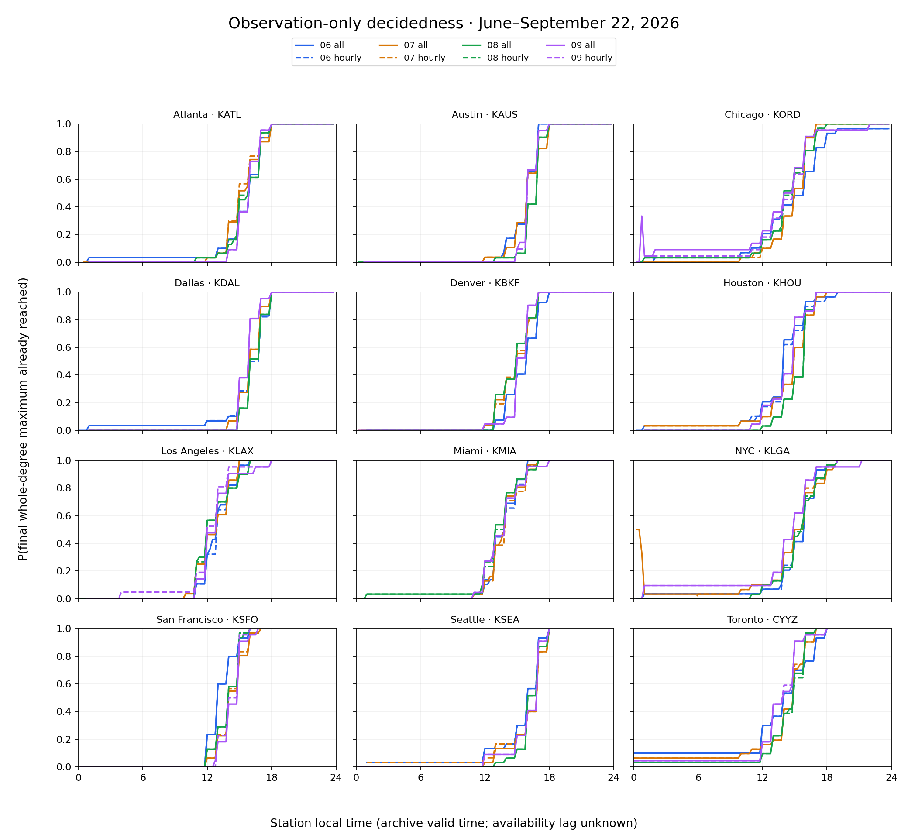
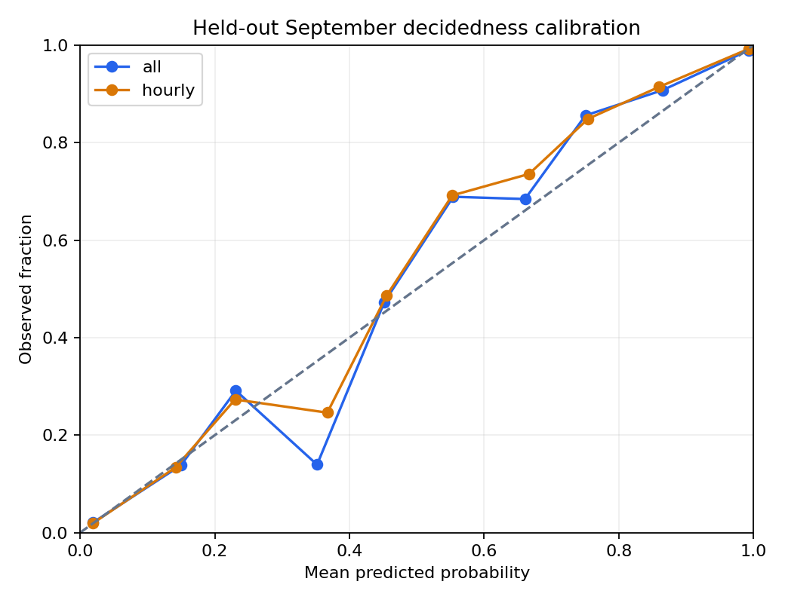

# 89b — Observation clock and band decidedness

**COMPLETE for the bounded archive measurement and inert library; NO-GO for treating these as live availability clocks or authoritative settlement probabilities. Routine minutes differ by station; hourly-rule filtering changes observed maxima. First-availability lag is unidentified.**

Historical research, 2026-09-23. Named handoff fetched at ded121ef94aeb066d1b88e5bea2291034b0bc6f7. Branch codex/observation-clock-20260923 starts at fetched origin/master 198f7ccbcd8e80271693462425582097d22b298b. Reserved-window status at execution: **NONE RESERVED**.

## Measurement contract

June 1–September 22 inclusive: 114 local dates × 12 configured settlement stations = 1,368 station-days. This is a newly downloaded public observation panel with no model-artifact regime, ledger, venue outcome or promotion-countable claim. Each station uses its own civil day and native unit (Toronto C, the other eleven F). No six-hour or 24-hour extrema enter instantaneous temperatures.

The [IEM METAR endpoint](https://mesonet.agron.iastate.edu/cgi-bin/request/asos.py?help=) distinguishes routine reports (report_type=3) and specials (4). Combined responses strip that distinction. Typed queries cover the full interval; 86a's cached temperatures supply 26,978 exact matches. High-frequency type 1 is excluded. Conflicting same-time archive revisions: {"routine_temperature_revision": 2, "unknown_temperature_revision": 1}. Typed conflicts exclude the entire affected day from fit, curves and calibration; partial observed maxima remain marked in the appendix. Identical timestamp/type duplicates count once.

An eligible day has temperature in all 24 local hours and no ambiguous typed revision. This is a sampling diagnostic, not proof that the physical high or every report was observed. All 1,368 days remain in the appendix. Eligibility is retrospective and cannot itself be a live gate. No empty prefix is carried from yesterday or converted to zero. Early-hour curve denominators condition on at least one in-day observation and can be small.

## T1: station clock

Counts are an archive census. Modal fractions use all routine reports, including rare off-minute observations. SPECI rates include all 114 requested dates. Rate intervals bootstrap dates (one fixed market: the degenerate crossed date × market case).

| Market / station | Routine reports | Modal local minute / fraction | SPECI | SPECI/day [95% CI] |
| --- | ---: | --- | ---: | --- |
| atlanta / KATL | 2737 | :52 / 99.93% | 385 | 3.38 [2.68, 4.13] |
| austin / KAUS | 2723 | :53 / 100.00% | 396 | 3.47 [2.91, 4.07] |
| chicago / KORD | 2735 | :51 / 99.93% | 589 | 5.17 [3.85, 6.63] |
| dallas / KDAL | 2733 | :53 / 99.93% | 219 | 1.92 [1.32, 2.67] |
| denver / KBKF | 2719 | :58 / 99.82% | 252 | 2.21 [1.63, 2.78] |
| houston / KHOU | 2735 | :53 / 99.93% | 294 | 2.58 [1.81, 3.46] |
| los-angeles / KLAX | 2728 | :53 / 99.96% | 403 | 3.54 [3.04, 4.04] |
| miami / KMIA | 2734 | :53 / 99.96% | 396 | 3.47 [2.85, 4.13] |
| nyc / KLGA | 2733 | :51 / 100.00% | 330 | 2.89 [2.18, 3.71] |
| san-francisco / KSFO | 2736 | :56 / 99.96% | 374 | 3.28 [2.82, 3.75] |
| seattle / KSEA | 2735 | :53 / 100.00% | 320 | 2.81 [2.20, 3.54] |
| toronto / CYYZ | 2736 | :00 / 100.00% | 441 | 3.87 [2.65, 5.23] |

[Full routine-minute distributions](agent-report-2026-09-89b-observation-clock-and-band-decidedness-routine_minutes.csv). [SPECI counts and frequencies by local hour and temperature-change bin](agent-report-2026-09-89b-observation-clock-and-band-decidedness-special_hour_change.csv). Absolute change bins are [0,1), [1,2), [2,4), ≥4 native degrees relative to the immediately preceding report within 90 minutes. Missing temperatures, simultaneous reports and longer gaps are unknown. These are report-conditional changes, not P(SPECI | an unobserved physical temperature change). SPECI is not restricted to the modal minute.

**Report-to-availability lag is not measurable at any of the twelve stations from these responses.** Archival download time is not first public availability. One-minute valid-time leads below are not publication latency.

## T3: curves and dead bands

At 00:00, 00:15, …, 23:45 local, admit only observations valid at or before the cutoff. R is the running maximum and M the final observed maximum under the same report definition. The primary decidedness indicator is round-half-up(R) = round-half-up(M), in whole settlement degrees. The exact-temperature companion requires equality of the unrounded archived values. Neither establishes physical or venue truth.

For inclusive band upper b, observed deadness is exactly 1[R_degree > b]. Across dates the requested probability is its empirical frequency. The upper-open tail is never dead; missing R stays unknown. The library accepts any b. Each curve cell retains the complete running-degree histogram, plus examples at station-specific training-high quartiles; summing histogram counts above any b reconstructs the probability for that band.

[All station × month × 15-minute curves, exact-temperature companion, intervals and dead-band histograms](agent-report-2026-09-89b-observation-clock-and-band-decidedness-curves.csv). [Station × month × hour means](agent-report-2026-09-89b-observation-clock-and-band-decidedness-hourly_curves.csv) average available quarter-hours within each date first. [Coverage and all station-days](agent-report-2026-09-89b-observation-clock-and-band-decidedness-station_days.csv). Curves are descriptive and include both fit and holdout months; only the estimator calibration below is held out.

## Held-out estimator and calibration

Fit the empirical remaining whole-degree rise M−R for each station, definition and quarter-hour on June 1–August 31; freeze before scoring September 1–22. Minimum 20 training dates per cell or abstain. P(decided) is mass at zero; adding historical rises to today's R gives P(final > b). No weather covariates, venue prices, reconstructed publication times, seasonal refit or held-out tuning. The in-sample fit check is computed before held-out summaries. The comparator is each station's training all-hour decidedness rate: beating this deliberately weak clock-free comparator says nothing about forecast skill or market edge.

| Definition | Eligible holdout station-days; dates × markets | Decidedness Brier [95% CI] | Δ vs constant [95% CI] | Final-above-band Brier [95% CI] |
| --- | --- | --- | --- | --- |
| all | 259; 22 × 12 | 0.0434 [0.0289, 0.0681] | -0.1956 [-0.2070, -0.1758] | 0.0937 [0.0697, 0.1199] |
| hourly | 259; 22 × 12 | 0.0419 [0.0289, 0.0618] | -0.1969 [-0.2076, -0.1809] | 0.0936 [0.0699, 0.1193] |

| Station | Train Brier all / hourly | Holdout Brier all / hourly [95% CIs] | Eligible holdout dates |
| --- | --- | --- | ---: |
| KATL | 0.0414 / 0.0412 | 0.0257 [0.0208, 0.0314] / 0.0259 [0.0210, 0.0317] | 22 / 22 |
| KAUS | 0.0273 / 0.0272 | 0.0178 [0.0137, 0.0229] / 0.0169 [0.0129, 0.0218] | 21 / 21 |
| KORD | 0.0610 / 0.0606 | 0.0949 [0.0444, 0.1613] / 0.0740 [0.0378, 0.1296] | 22 / 22 |
| KDAL | 0.0336 / 0.0338 | 0.0237 [0.0188, 0.0288] / 0.0238 [0.0189, 0.0289] | 21 / 21 |
| KBKF | 0.0365 / 0.0363 | 0.0265 [0.0205, 0.0354] / 0.0265 [0.0204, 0.0354] | 21 / 21 |
| KHOU | 0.0505 / 0.0508 | 0.0412 [0.0294, 0.0549] / 0.0416 [0.0296, 0.0557] | 22 / 22 |
| KLAX | 0.0366 / 0.0365 | 0.0378 [0.0239, 0.0574] / 0.0488 [0.0240, 0.0874] | 21 / 21 |
| KMIA | 0.0392 / 0.0405 | 0.0410 [0.0292, 0.0553] / 0.0408 [0.0291, 0.0544] | 22 / 22 |
| KLGA | 0.0542 / 0.0507 | 0.0922 [0.0346, 0.1687] / 0.0876 [0.0327, 0.1653] | 21 / 21 |
| KSFO | 0.0299 / 0.0294 | 0.0266 [0.0206, 0.0345] / 0.0233 [0.0195, 0.0277] | 22 / 22 |
| KSEA | 0.0389 / 0.0451 | 0.0330 [0.0192, 0.0507] / 0.0332 [0.0197, 0.0506] | 22 / 22 |
| CYYZ | 0.0703 / 0.0703 | 0.0599 [0.0321, 0.1072] / 0.0602 [0.0325, 0.1075] | 22 / 22 |

[Reliability bins by station and fleet, including calibration-gap intervals](agent-report-2026-09-89b-observation-clock-and-band-decidedness-calibration.csv). Plot p/y are row-weighted; gap intervals weight date-market cell means equally and are labelled separately. Calibration is not uniformly good: in the all-report 0.3–0.4 bin, 172 grid rows average 0.352 predicted versus 0.140 observed; its cell-weighted gap interval excludes zero. This exploratory, unadjusted bin finding is not a correction fitted to the holdout. The 0.7–0.8 bin errs the opposite way. Most other bin gaps are not distinguishable from zero. Band-upper examples use the median of distinct training-high quartiles; that fixed upper and every prediction are retained under ignored data/observation_clock_89b/results/heldout_predictions.csv and hash-bound in provenance.

Uncertainty uses independent date and market bootstrap weights, 2,000 draws (1,000 for descriptive curves), seed 890923. Each date-market cell averages its grid rows first. Per-station intervals hold one market fixed. Fleet calibration has 22 date and 12 market clusters. Adjacent weather dates may be dependent; these exploratory intervals do not guarantee seasonal generalization. Degenerate empirical intervals cannot prove population certainty. No alpha budget or promotion decision is spent.

The 80%-power normal-approximation MDE for the paired Brier delta is 2.8016 × crossed-bootstrap SE:

- all: MDE 0.0219; plug-in power at the observed delta 100.0%.
- hourly: MDE 0.0188; plug-in power at the observed delta 100.0%.

Plug-in power is descriptive, not independent or prospective evidence. Both deltas are distinguishable from zero against the weak constant comparator. Power against venue truth or market forecasts is unidentified: neither outcome is in this study.

## Hourly-rule sensitivity and one-minute comparison

86a's retained Rules check says current Rules use WRH Hourly Data. The [WRH help](https://www.weather.gov/wrh/timeseries?site=klga) specifies :51–:59 for NWS/FAA platforms and :56–:04 for others. We retain 86a's proxy mapping (K-prefixed configured stations use the former, CYYZ the latter); WRH's platform assignment, especially military KBKF, is not independently verified here. Applying the filter to IEM does not reproduce WRH feed selection, precision, revisions or settlement cutoff. No venue call rechecked Rules; this is not an adopted resolution source.

| Station | Eligible days all / hourly | Different degrees / common days | ASOS days any / ≥90%+24h | Median ASOS−METAR degree on adequate common pairs | Median valid-time lead, min |
| --- | ---: | ---: | ---: | ---: | ---: |
| KATL | 114 / 113 | 3 / 113 | 106 / 74 | 1 (n=74) | 78 (n=74) |
| KAUS | 109 / 109 | 0 / 109 | 103 / 30 | 1 (n=30) | 82.5 (n=30) |
| KORD | 112 / 112 | 4 / 112 | 106 / 51 | 1 (n=49) | 62 (n=48) |
| KDAL | 110 / 109 | 0 / 109 | 107 / 95 | 1.5 (n=92) | 96.5 (n=92) |
| KBKF | 102 / 101 | 1 / 101 | 0 / 0 | — (n=0) | — |
| KHOU | 112 / 112 | 1 / 112 | 113 / 97 | 1 (n=95) | 74 (n=95) |
| KLAX | 107 / 107 | 3 / 107 | 100 / 19 | 2 (n=17) | 74 (n=17) |
| KMIA | 112 / 112 | 6 / 112 | 106 / 24 | 2 (n=24) | 109 (n=24) |
| KLGA | 111 / 111 | 7 / 111 | 105 / 18 | 1 (n=17) | 66 (n=17) |
| KSFO | 114 / 113 | 2 / 113 | 107 / 43 | 2 (n=43) | 62 (n=43) |
| KSEA | 113 / 113 | 1 / 113 | 110 / 51 | 1.5 (n=50) | 93.5 (n=50) |
| CYYZ | 114 / 114 | 2 / 114 | 0 / 0 | — (n=0) | — |

Of 1326 common eligible station-days, 30 have different whole-degree maxima. [Every day and difference](agent-report-2026-09-89b-observation-clock-and-band-decidedness-rule_and_asos.csv) includes the fraction of paired grid points with different decidedness, even when final degrees agree. All-report maxima cannot be below the hourly subset.

ASOS lead compares the first one-minute observation reaching the **METAR day's final degree** with the first METAR reaching that same threshold. Positive means an earlier archived observation, not earlier public availability. The medians are descriptive census summaries with pair counts, not inferential equivalence claims. ASOS adequate pairs require ≥1,296 minutes and all 24 hours; gaps can still hide a maximum.

The [IEM one-minute service](https://mesonet.agron.iastate.edu/cgi-bin/request/asos1min.py?help=) is an NCEI archive, not the MADIS minute feed, and documents about 24 hours of availability delay. Actual retained coverage is incomplete. Toronto is unsupported by the existing US-only resolver; KBKF returned no usable minute temperatures. The September 22 requests returned only earlier UTC-envelope rows for some stations and no local September 22 minute observations. Empty responses are missingness, not weather.

## Proposed calendar diff — not applied

The library exposes the dated historical STATION_ROUTINE_MINUTES table and a pure clock_table builder. A future reviewed change should resolve the station, permit explicit per-station overrides and preserve other source configuration. Keep existing pre/post buffers until prospective first-seen evidence can calibrate them. Modal minutes never imply SPECI-free periods.

~~~diff
--- a/src/weather/market/info_event_calendar.py
+++ b/src/weather/market/info_event_calendar.py
@@ imports
+from weather.market.observation_clock import STATION_ROUTINE_MINUTES
@@ def _scheduled_hourly_events(...):
-    minutes = [int(value) for value in spec_config.get("minutes") or []]
+    configured = spec_config.get("minutes") or []
+    if source == "metar":
+        station = spec_for_id(market_id).icao.upper()
+        overrides = spec_config.get("station_minutes") or {}
+        configured = overrides.get(station, STATION_ROUTINE_MINUTES.get(station, configured))
+    minutes = [int(value) for value in configured]
~~~

This is a review proposal only; info_event_calendar.py and its config are unchanged. Unknown stations retain a clearly labelled fallback. A future change needs override/fallback tests, table freshness policy, latency evidence and production roll qualification.

## Reproduction and provenance

From this branch's repository root, choose the installed project interpreter as $python. The worktree used the main checkout's venv by absolute path. Ignored cache is not guaranteed in a clean checkout; a later recollection needs new owner authority and a new mission deadline, not guard removal.

~~~powershell
& $python tools/observation_clock_20260923.py --help
# Optional verified reuse; supply the actual 86a cache root:
& $python tools/observation_clock_20260923.py reuse --reuse-root <86a-cache-root>
# Only inside this mission's authorized network window:
& $python tools/observation_clock_20260923.py collect --network
# Offline rebuild:
& $python tools/observation_clock_20260923.py analyze
& $python tools/observation_clock_20260923.py report
~~~

One serial foreground collector, ≥15 seconds after request completion between IEM requests, hash-verified cache, no automatic retries or redirects, no ambient netrc/proxy credentials, 64 MiB response bound and socket timeouts. A process timer terminates blocked requests at 2026-09-23 19:45 ET. data/observation_clock_89b/STOP prevents new requests. No background collector or schedule remains.

[Source URLs, hashes, timestamps, training/held-out estimates and artifact hashes](agent-report-2026-09-89b-observation-clock-and-band-decidedness-provenance.json). Raw bodies and detailed held-out predictions remain under this worktree's ignored data/observation_clock_89b. Report CSV/JSON appendices use LF.

## Handback boundary

No .env, credential, venue call, RE-1 worktree access, model work beyond the requested timing estimator, candidate, serving, floor, gate, ledger, config, release or production write; no registration, restart or merge. The original checkout and other worktrees were preserved. Exact instrument commit, verification and tool-derived roll result follow in the addendum; the final report commit cannot embed its own hash.

## Verification addendum

Instrument commit: **5e7a781b348e466336e9102ef63b4e0aa554cde9**. Branch:
**codex/observation-clock-20260923**. Isolated worktree:
C:/Users/Michael/Documents/github/weather/scratch/w/observation-clock-20260923.
The main checkout remains on its original master without source edits.

- Reused 27 hash-verified public IEM responses from 86a; 23 contain raw
  report/minute fields consumed here, and four summary-only requests remain
  retained but unused. Added 14 successful HTTP 200 responses, without retry.
  Collection finished **2026-09-23 17:23:45 UTC / 13:23:45 ET**, before
  19:45 ET. A STOP sentinel is now present; no collector remains.
- Final focused tests and import architecture ratchet: **44 passed in 9.21 s**
  through the shared-lease workstation wrapper. The first run had 42 passes
  and one tracking-ratchet failure before the four new files were staged.
  The staged rerun passed 43; the added revision fixture brought the final
  total to 44. No test was weakened.
- Focused compileall of the three changed Python files passed through that
  wrapper. No full suite or broad compileall ran. No canonical guide, roadmap
  item or generated backlog changed; their generators were not invoked.
- Both figures were rendered and visually inspected. Response and CSV hashes
  are retained in provenance. Detailed predictions and raw bodies remain in
  ignored data.
- Offline artifact validation checked eight result hashes, identical published
  CSV copies, every report link and 1,368 unique station-days. Independent
  normalization through the existing source adapters reproduced June 2
  maxima: NYC METAR 76 F, Toronto METAR 25 C, NYC one-minute ASOS 77 F.
  Owned pytest temporary directories were removed after verification, using
  an exact absolute-path check; cache and research evidence were preserved.
- The repository roll-verdict tool returned **UNDECIDABLE (exit 1): no live
  closure evidence**. All four required capture status files are absent.
  The early refusal did not write the requested JSON output. Production
  integration requires a fresh tool verdict; the authorized branch push does
  not depend on capture restart sensitivity.

| Changed path | Per-file production closure verdict |
| --- | --- |
| src/weather/market/observation_clock.py | Unverified: required live closures absent |
| tools/observation_clock_20260923.py | Unverified: required live closures absent |
| tests/market/test_observation_clock.py | Unverified: required live closures absent |
| tests/fixtures/observation_clock_reports.csv | Unverified: required live closures absent |
| This report and ten evidence appendices | Research evidence only; no runtime adoption; production tool verdict still required |

Exact commands run from the worktree above (interpreter and source-cache
paths existed on this host):

~~~powershell
$python = 'C:/Users/Michael/Documents/github/weather/venv/Scripts/python.exe'
& $python tools/observation_clock_20260923.py reuse --reuse-root ../settlement-truth-20260922/data/settlement_truth_86a
& $python tools/observation_clock_20260923.py collect --network
& $python tools/observation_clock_20260923.py analyze
& $python tools/observation_clock_20260923.py report
$argsJson = @('-m','pytest','tests/market/test_observation_clock.py','tests/operations/test_import_architecture.py','-q','--basetemp','data/observation_clock_89b/test-tmp/final') | ConvertTo-Json -Compress
$encoded = [Convert]::ToBase64String([Text.Encoding]::UTF8.GetBytes($argsJson))
./scripts/ops/workstation_heavy.ps1 -Kind pytest -PythonPath $python -ArgumentsBase64 $encoded -RepoRoot (Get-Location).Path
$argsJson = @('-m','compileall','-q','src/weather/market/observation_clock.py','tools/observation_clock_20260923.py','tests/market/test_observation_clock.py') | ConvertTo-Json -Compress
$encoded = [Convert]::ToBase64String([Text.Encoding]::UTF8.GetBytes($argsJson))
./scripts/ops/workstation_heavy.ps1 -Kind compileall -PythonPath $python -ArgumentsBase64 $encoded -RepoRoot (Get-Location).Path
./scripts/ops/roll_verdict.ps1 -Branch HEAD -Base origin/master -JsonOut data/observation_clock_89b/roll-verdict.json
~~~

These are historical commands, not authority to remove STOP, resume network
during RE-1, or collect after the deadline. Offline analysis/report commands
remain reproducible from the cache. The verification addendum is hand-authored;
regenerating a report does not claim fresh tests, a commit or a roll verdict.
