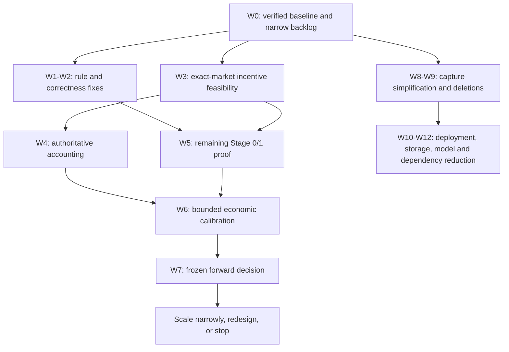

# 330. Maker Economics And Liquidity Rewards Refocus Master Plan [PARTIAL 2026-09-05 - NON-LIVE IMPLEMENTATION STARTED; ECONOMIC PROOF OPEN]

Goal: determine whether a narrowly scoped International Polymarket weather
maker can earn worthwhile returns from trading plus realized incentives, while
reducing the system to what that decision and safe evidence collection require.

Owner/package: `weather.market` owns the experiment and accounting;
`weather.collection` owns primary evidence; `weather.operations` owns deployment
and containment; `weather.reporting` owns decision reports. One integration
owner coordinates changes to shared contracts. The operator owns capital,
statistical error-budget allocation, live-session authority, and scale decisions.

Source: operator acceptance of the read-only repository audit and request on
2026-09-04 to refocus on maker economics plus liquidity rewards; the current
[established findings](../../operations/ESTABLISHED_FINDINGS.md),
[retractions](../../operations/RETRACTED_AND_FALSE_LEADS.md), and
[International pilot contract](../../operations/INTERNATIONAL_MM_LIVE_PILOT.md).

Why this matters: earlier model, taker, reporting, and incident-response work
still consumes implementation attention and operational resources. A smaller
active system should reach an honest economic decision sooner. Liquidity
rewards are a testable revenue source, not assumed profit and not interchangeable
with maker rebates.

Acceptance: complete the work-package dispositions below, preserve required
replay and execution contracts, and produce a reconciled economic decision:
continue a bounded profitable opportunity, redesign one specifically diagnosed
constraint, or stop an uneconomic/infeasible experiment. Profit is not required
to close this item honestly. A plan, green suite, paper fill, or no-fill lifecycle
PASS alone cannot close it.

## 1. Decision and scope

The experiment asks whether **gross trading P&L + paid maker rebates + paid
liquidity rewards - all relevant costs** produces a worthwhile result at a
feasible capital level. Rewards-dependent profitability is an acceptable result
if receipts prove it and its dependence on the programme is explicit. Profitable
trading without rewards is useful, but is not a prerequisite imposed on the
operator's rewards hypothesis.

The initial policy is market-centred, backed, post-only quoting. Weather evidence
protects settlement interpretation, impossible outcomes, information-event risk,
and inventory. A new predictive model or model-promotion result is not required.
Risk controls remain mandatory even when model probabilities are absent.

On September 4 the owner authorized implementation of this plan, necessary
source-control changes and merges, and takeover of unfinished cold off-site
storage work, with one explicit exception: **no live trading**. Continue that
authorized work without blanket approval prompts. Existing exact host-admission,
guarded integration, retention, manifest and restore contracts still govern
execution; off-site authority does not make an unverified copy reclaimable.
Real W5-W7 lifecycle/economic sessions remain blocked by the no-live instruction;
their offline preparation may proceed. The prospective Stage 0/1 10 pUSD request
and 100 pUSD wallet ceilings remain unchanged. No new statistical alpha allocation,
exchange-baseline acceptance, unattended operation or positive economic verdict
is inferred from the implementation authorization.

## 2. Starting point and what must be refreshed

This is a dated planning snapshot, not a live-host attestation. The plan branches
from fetched `origin/master` at
`423b4d5888ecd3f4e34b84e6fd3fb03c93ded933`. The audit inspected an earlier tip;
the intervening host-load change adds a focused Windows/Linux hook workflow.
Do not implement that already-landed coverage a second time. Broader Windows
lifecycle coverage still needs a gap assessment.

At intake, the production checkout had existing modifications only in
`config/locations.json` and `config/location_market_events.json`; they were
excluded from the original planning change. The intake state-of-play narrative
described an older reconciliation; the current [state of play](../../operations/STATE_OF_PLAY.md)
now records the verified baseline and next decisions. Git ancestry establishes
landed source, but does not establish worker health, remote executor readiness,
receipt validity, or current account state.

Existing capabilities to reuse:

| Capability | Existing owner | Remaining question |
| --- | --- | --- |
| Model-independent paper intent | [Item 328](item-328-paper-only-market-harvest-permission-lane.md) | Does a fresh safe candidate qualify for the intended experiment? |
| Current market economics and acceptance | [Item 309](item-309-exchange-economics-snapshot-production-verification-and-accept-baseline.md) | Are exact-condition reward settings current and economically usable? |
| Backed authenticated lifecycle | [Item 67](item-67-authenticated-exchange-adapter-and-mm-2-pilot-harness.md) | Which stages are actually integrated, qualified, and proved on the assigned host? |
| Public execution tape | [Item 326](item-326-supervised-continuous-public-execution-tape.md) | Is the selected interval complete enough for the stated counterfactual? |
| Book/reward competition analysis | [Item 66](item-66-clob-book-recon-and-reward-competition-analytics.md) | Which calculations survive current venue rules and present book competition? |
| Paper simulation and incentives | [Item 44](item-44-paper-trading-queue-simulation-markouts-and-incentive-accounting.md) | Which fields are estimates, and which can reconcile to our actual account? |
| Bounded settlement refresh | [Item 324](item-324-bounded-daily-settlement-refresh-resource-admission-and-step-isolation.md) | Which jobs are essential to this experiment? |
| Storage and guarded integration | [Item 325](item-325-tiered-data-retention-and-verified-archive-offload.md), [Item 329](item-329-immutable-overnight-integration-attempt-recovery.md) | Which existing primitives can replace duplicate work? |

No current reward-bearing weather condition, profitable opportunity, completed
Stage 0/1 successor, or paid incentive was established by this planning task.
These are named gates, not facts to fill from old reports.

## 3. Revenue and evidence contract

### Three separate components

| Component | Economic mechanism | Evidence accepted as realized |
| --- | --- | --- |
| Trading P&L | Entry/exit or settlement cash flows from our confirmed fills | Complete attributable fills, fees, positions, settlement/redemption, and account cash reconciliation |
| Maker rebates | Venue payment associated with eligible executed maker liquidity | Completed-period exact-account/condition rebate evidence reconciled to wallet credit |
| Liquidity rewards | Venue payment for qualifying resting liquidity | Exact campaign and eligible-order evidence plus completed reward-period earnings/distribution and attributable wallet credit |

Official documentation checked on 2026-09-04 Toronto time distinguishes the
programmes. Liquidity rewards use market-specific size/spread settings and
relative quote scoring; maker rebates require executions. Both describe minimum
payouts. Fetch actual settings and reconcile payments at experiment time rather
than copying today's rates into a policy. Sources:
[liquidity rewards](https://docs.polymarket.com/programs/liquidity-rewards) and
[maker rebates](https://docs.polymarket.com/programs/maker-rebates).

Extend the existing economics snapshot and receipt family; do not create a
second accounting stack. Preserve raw field names, assets, source URLs, request
scope, hashes, timestamps, and rule versions. A field ending in `usdc` does not
prove which asset arrived. A configured reward pool is not a receivable. A
positive accrual is not a paid receipt. Missing evidence is not zero.

A no-fill cohort with attributable paid liquidity rewards and complete cash
reconciliation can establish reward income for that exposure. It cannot establish
fill quality, adverse selection after fills, or robustness to a different flow
regime. This is distinct from a no-fill lifecycle PASS with no economic receipts.

### Accounting identity and attribution

For a fully closed, isolated episode:

```text
cash result = ending cash - starting cash - deposits + withdrawals
cash result = gross trading P&L - execution fees - cash expenses
              + paid maker rebates + paid liquidity rewards
economic result = cash result - external operating costs not already in cash
```

Bind all legs to one account, period, conditions, orders, and asset basis. Require
zero ending positions for a terminal cash proof; otherwise report an open cohort
with explicit conservative liquidation/settlement valuation and unresolved risk.
Do not quietly mark inventory at midpoint and call the result realized.

Do not add spread capture or subtract adverse-selection markouts again when
realized trading P&L already includes those effects. Markouts diagnose the result.
Likewise, a wallet delta already containing incentives must not have incentives
added a second time. Use the existing reconciliation precision contract, with
explicit rounding and residual handling.

Reward credits may aggregate multiple sessions or markets. Allocate only when
venue evidence supports the allocation; otherwise report a portfolio-period
receipt and leave session attribution unknown. Include all intervening external
cash flows and expenses. A completed, successful exact-scope empty query is a
reconciled zero; a failed, partial, or premature query is incomplete. Re-query
after the documented payout cycle and record unpaid amounts separately, without
assuming they carry forward or will eventually be paid.

Report four views: trading only; trading plus paid rebates; trading plus both
paid incentives; and the last view after incremental and fully allocated
operating costs. Record capital-hours, maximum collateral tied up, operator
minutes, and operating expense without pretending sunk development cost must be
recovered by the first tiny pilot.

## 4. Gates and execution order



These are dependency lanes, not permission to run parallel heavy jobs or spawn
agents. Follow the host and delegation contracts. Work proceeds in small reviewed
changes; broad cleanup does not hold the economic lane hostage.

| Gate | Required result | Refusal or alternative |
| --- | --- | --- |
| G0: truthful baseline | Exact integrated source, pending branch dispositions, applicable host/stage, and current evidence gaps recorded | Repair the specific mismatch; never reconstruct a spent attempt |
| G1: feasible opportunity | At least one exact condition fits current rules, risk limits, reward eligibility, and a plausible after-cost range | If rewards are infeasible, say so; evaluate a separately labelled rebates-only hypothesis or stop |
| G2: measurable lifecycle | Required Stage 0/1 evidence plus complete accounting fixture coverage; exact Stage 2 code/host authority identified | No economic orders until the missing stage or authority is resolved |
| G3: measurable economics | A bounded calibration cohort closes through payout and settlement; exclusions and residuals explained | Diagnose once under a fixed effort budget; do not count incomplete sessions as profit |
| G4: decision | Frozen forward protocol reaches its prespecified economic, uncertainty, and risk criteria | Record inconclusive, insufficient opportunity, or uneconomic as distinct results |

Only defects necessary for G1-G3 belong ahead of the first measured cohort.
Immutable deployment migration, broad model retirement, and archive cleanup
are not blanket prerequisites.

## 5. Work packages

### W0 — Establish the current baseline and prune the active agenda

Owner: operations/documentation. Depends on: none.

Verify integrated Git ancestry, outstanding candidate lineages, current host
assignment, and terminal receipts through their existing read-only paths. Mark
anything not inspected as unverified. Replace stale state-of-play incident prose
with the actual next decision, preserving historical receipts in their owners.
Inventory backlog items as essential now, optional research, or retired by an
explicit disposition. Use existing roadmap statuses: discontinued/superseded
work can close with that reason; deferred useful work must not pretend completion.

Deliver one short critical path and an owner/decision for each currently active
recurring job. The initial active agenda is candidate feasibility, lifecycle,
cash accounting, and essential capture/settlement reliability. No new predictor,
market expansion, taker strategy, dashboard redesign, or generic platform work
enters it without replacing an item or naming a measured blocker.

Acceptance: a new agent can identify the next executable non-live action and
why it matters without reading dated correspondence. Evidence: read-only source
and receipt references, roadmap lint, docs audit. Historical branches/evidence
remain intact; no runtime rollback is needed for this documentation change.

### W1 — Make governance compatible with simplification

Owner: operations/documentation/tests. Depends on: W0.

Shorten root/scoped agent guidance; distinguish capture protection from a streak
objective; bind handoffs to task/host/scope instead of global newest-file order.
Reconcile Git versus runtime adoption, role authority, branch retention, and
machine-local memory references. Retain one owner per durable contract.

Change `test_module_size_audit.py` from an exact warning-count requirement to a
no-regression contract that accepts reductions. Permit a truthful reviewed/no-
change documentation transaction rather than demanding meaningless diffs.
Preserve exact integration ancestry, evidence binding, and required factual
updates. Compress findings into a current claim index with linked historical
support; correct statistical scope without rewriting published transcripts.

Acceptance: reducing module debt and unchanged accurate docs both pass; new
unowned complexity and stale required facts still fail. Test both positive and
adversarial paths. Retire superseded rules in the same change, not a new layer
that overrides them. Revert code changes coherently if verification fails.

### W2 — Repair identity and configuration publication

Owner: `weather.market`, `weather.operations`. Depends on: W0.

In `market_registry.spec_for_id`, default only when the ID is absent; reject an
explicit unknown ID. Keep `market_config` identity, timezone, event and units
consistent. Check explicit empty/whitespace behavior and existing callers.

Use the existing atomic JSON helper for configuration refresh. Publish a
consistent generation across readers of both files, and validate before
publication. Apply the existing metadata-only path where compatible; remove
refresh timestamps from stable definitions. Migrate discovered event metadata
to runtime snapshots with exact lineage while retaining stable market/location
definitions in Git. Stage reader compatibility before changing scheduled writers.

Acceptance: typo IDs cannot yield Toronto metadata; interrupted refresh cannot
expose partial JSON or an accepted mismatched pair; ordinary event discovery
does not dirty durable location definitions. Tests cover Celsius/Fahrenheit,
missing/unknown IDs, interrupted writes, concurrent reads and old/new schemas.
Keep the prior complete generation for rollback; never overwrite current dirty
config as a cleanup shortcut. Full runtime-state migration can follow G3 if the
bounded candidate path is already safely consistent.

### W3 — Prove incentive feasibility before building more trading machinery

Owner: `weather.market.exchange_economics`, `clob_recon`. Depends on: W0;
uses W2 for any affected identity/publication path.

Produce one bounded exact-condition opportunity table from existing public
capture and permitted current collection. Include venue condition/token IDs,
active campaign dates, reward allocation, qualifying minimum size, qualifying
spread convention and midpoint, tick, exchange order minimum, eligibility by
side/price, book age/depth, competing qualifying liquidity, remaining useful
quoting time, and rule-source timestamps/hashes. Do not infer weather campaign
eligibility from a category label or a previous day's condition.

Compute the minimum fully backed capital for each allowed order combination,
including simultaneous orders, inventory and cleanup reserve. Exchange minimum
size and reward minimum size are different constraints. No unbacked sell,
implicit borrowing, cross-condition hedge, cap increase, or new wallet operation
is introduced to make a row feasible.

Estimate rewards as ranges using observed competition and time participation;
our quote changes the score denominator. Include no-payment, dilution, incentive
reduction/removal, partial fill, cancellation delay, adverse selection, forced
exit and settlement-loss cases. Report attainable payment thresholds within the
planned exposure horizon. Public replay cannot prove our queue position or fills.

Acceptance: select a feasible condition by a recorded rule, or produce a bounded
infeasibility result identifying capital, duration, competition, or unavailable
campaigns. Do not loop on tiny sessions that cannot reach qualification or a
meaningful payout. Fixtures cover zero campaign, expired rules, cents/price-unit
conversion, price extremes, changing competitors, tick/size and cap boundaries.
Reuse existing recon and economics schemas; add only missing fields/readers.

### W4 — Complete authoritative reward and P&L reconciliation

Owner: `weather.market.market_making_evidence`, pilot and economics owners.
Depends on: W3's field contract; fixture work can start before real collection.

Inventory the existing account, fill, position, fee, rebate and settlement
readers before coding. Add the smallest missing liquidity-reward earnings and
distribution path using verified official interfaces. Retain exact request
scope and completeness/pagination evidence. Check actual order-scoring status
where supported; our computed eligibility is diagnostic until verified.

Use the documented [active reward configurations](https://docs.polymarket.com/api-reference/rewards/get-current-active-rewards-configurations),
[order-scoring status](https://docs.polymarket.com/api-reference/trade/get-order-scoring-status),
and [daily user earnings](https://docs.polymarket.com/api-reference/rewards/get-earnings-for-user-by-date)
as the initial interface review map. Verify SDK support, authentication and
pagination before implementation. Earnings rows still require wallet-payment
reconciliation; the existence of an endpoint is not a payment proof.

Represent lifecycle, accrual, completed zero, payment, and unresolved evidence
separately. Match distributions without allocating the same credit twice. Extend
the existing cash identity to distinguish liquidity rewards from maker rebates.
Keep the current conservative zero assumed-reward paper contract: measured
actual rewards belong in a versioned evidence field, not in a fabricated paper
profit or a relaxed safety permission.

Acceptance: deterministic episodes reconcile with fills/no fills, one-sided
fills, partials, duplicate/out-of-order events, failed/pending fills, delayed
credits, below-threshold accrual, zero reward, account-wide credits, external
cash flows, wrong assets, and stale/incomplete queries. Mixed-version consumers
must reject unsupported claims rather than drop the new component silently.
If public/official evidence cannot attribute rewards, report that limitation
and keep realized reward P&L incomplete. Rollback preserves raw receipts.

### W5 — Finish only the remaining lifecycle proof

Owner: existing item 67/pilot and fixed-scope wrapper owners. Depends on: W2,
W3, and actual G0 branch/host qualification.

Verify the current integrated and portable candidate tips; do not assume a
historically green Stage 2 branch is currently runnable. Complete missing Stage
0/1 gates through the existing smallest-valid protocol. Preserve spent attempts,
one-submit capability, no retry on ambiguous mutation, authenticated cancellation,
heartbeat-lapse proof, exact account/condition binding, and terminal cleanup.

Add focused Windows integration coverage only for uncovered process/Scheduler/
Job behaviors. Reuse the new Windows/Linux hook workflow. No entire Windows
test migration is required before a narrowly proved stage.

Acceptance: required terminal receipts prove the actual assigned lane and code.
Stage 0/1 remains plumbing evidence even if a reward API responds. The portable
profile currently authorizes Stage 0/1 only: Stage 2 requires an explicit reviewed
host/profile decision or the already authorized canonical host lane. Never
extend the profile by renaming a workload. Any real session remains an attended,
separately authorized action under the runbook. A failure stops and reconciles;
it does not consume a second mutation ordinal.

### W6 — Run a bounded economic calibration cohort

Owner: market experiment/integration owner and attending operator. Depends on:
G1, G2, W4, and exact authorization for the economic stage.

Freeze a minimal baseline policy: one event/band at a time initially, exact
post-only price/size/TTL, backed inventory, cancel behavior, event-risk pulls,
and portfolio/event limits. Express reward qualification independently of
whether a model exists. Record every eligible session opportunity, including
no-quote and no-fill outcomes. Do not loosen a midpoint or safety gate simply
because convenient candidates are absent.

Use the existing one-TTL Stage 2/settlement progression first. If useful reward
exposure needs repeated TTLs or longer attendance, design a bounded successor
with exact order-count, duration, loss and inventory budgets for review. Do not
turn the one-TTL gate into an unattended market maker by iteration.

Proposed planning budget: at most five attended calibration sessions and two
completed payout cycles, within fourteen calendar days after G2, subject to
the operator's smaller capital/loss/time envelope. This is a discovery budget,
not a statistical sample-size claim or present trading authorization. Include
all cohort settlements and late payout reconciliation after quoting ends.

Acceptance: one report joins intent, exchange lifecycle, score eligibility,
confirmed fills, multihorizon markouts, inventory, costs and eventual receipts.
It estimates opportunity rate, capital use, loss variability, reward realization
and operational effort well enough to design W7, or states which constraint
prevents a meaningful study. Permit one specifically scoped redesign after a
documented diagnosis; repeated plumbing passes do not reset the budget.

### W7 — Freeze a forward economic decision protocol

Owner: experiment/reporting; operator owns alpha and economic thresholds.
Depends on: W6. Offline analysis uses the admitted non-capture workstation.

Before confirmation, freeze candidate selection, policy/code/rules regime,
cost allocation, inclusion/exclusion, capital allocation, settlement treatment,
reward reconciliation deadline, and the review schedule. Discovery observations
are labelled exploratory. Changing the policy or selection rule creates a new
cohort; failed sessions are retained in operational opportunity denominators.

Primary endpoint: after-cost cash/economic result for the frozen capital and
quoting-time allocation, including paid incentives. Report absolute profit,
capital-hours, drawdown, reward dependence, and operator time alongside it.
Agree the minimum practically useful result with the operator before looking
at confirmation outcomes. Break-even discovery alone is not a business case.

Use prospective MDE/sample sizing from calibration variability and attainable
opportunity frequency. Account for within-date serial dependence, related bands,
shared payout periods, and cross-market dependence. Date-by-market clustering
must reflect actual data; one market cannot identify fleet generalization.
Do not use observed-effect power as a second independent confirmation gate or
call a Gaussian sensitivity quantile a guaranteed heavy-tail lower bound.
Only the operator allocates statistical alpha; no ledger allocation is implied.

The frozen decision table must define the hurdle H in the primary endpoint's
units and the supported population. Continue to a separately reviewed bounded
extension only when the prespecified lower uncertainty bound exceeds H, all
risk limits hold, and cash evidence closes. Stop the tested policy when its
upper bound falls below H or a predefined loss/operational stop is reached.
Overlapping bounds at the exposure budget are inconclusive, not a pass. Allow
one bounded redesign only for a named mechanism supported by diagnostics; a
redesign uses a new cohort rather than resetting the old evidence. If a valid
bound cannot be estimated, report descriptive results and an unproved claim.

Choose a fixed review or a valid prespecified sequential design, not repeated
unadjusted significance checks. Compare against zero capital/no quoting and
report incentive-free accounting; any alternative quoting policy is a separate
prespecified comparison, not a retrospective winner. Keep market-centred and
model-assisted claims distinct. Consult the reserved-window contract before
every dated study; there are currently no reserved dates, but a later model
freeze can change that and grants this plan no exemption.

Proposed outer planning budget: thirty calendar days of new exposure following
freeze, followed by settlement/payout closeout. Set actual session/date counts
from W6 before execution. If the required information cannot fit that budget,
record an infeasible confirmation and choose a narrower question or stop; do
not claim thirty days proves anything by itself.

Acceptance: G4 returns continue, redesign, stop, or inconclusive with interval/
uncertainty, economic hurdle, risk and dependence disclosures. Scaling is a new
bounded decision. Change one dimension first (duration, markets or size), keep
concentration and tail exposure explicit, and remeasure reward dilution and
incentive dependence. No automatic capital promotion or unattended deployment.

### W8 — Remove optional research from the capture critical path

Owner: collection/operations. Depends on: W0; supports but need not block W6.

Persist primary snapshots before optional variant predictions. Prefer captured-
input replay outside the capture process. Inventory configured variants and
release-bound selection separately; disable default research participation
without a named current hypothesis, preserving archived artifacts and readers.

Reduce daily defaults to essential settlement/evidence work and the bounded
maker report. Make closed taker analyses, model scoring/retraining and the dated
June 23 repair on-demand. Preserve stage barriers and finalization for genuine
unresolved evidence. Stage B is already disabled by default; distinguish removing
maintained default steps from stopping a task that is actually running.

Acceptance: slow/failing optional predictions cannot prevent the core durable
snapshot; fault injection verifies crash boundaries. Measure capture delay,
loaded dependency closure, per-job duration/memory and daily bytes before/after
on the appropriate host. Canary adoption and roll verdict/recovery proof remain
required. Preserve a compatible prior configuration and source release for rollback.

### W9 — Delete obsolete surfaces with a consumer/evidence disposition

Owner: owning package plus integration owner. Depends on: W0; independent of
economic success. Each deletion is a small reviewed change with its dead tests
and active documentation references removed together.

| Candidate | Disposition and acceptance |
| --- | --- |
| Inert `fix_app.py`, `train_all.py`, `train_all2.py` research stubs | Remove stubs and harness entries; no active caller needs the retirement CLI |
| Expired August 23 protected-window exception | Remove executable exception, preserve incident evidence, retain ordinary fail-closed behavior |
| Live US adapter and duplicate handwritten International adapter | Confirm external and in-repo callers; remove only unused implementations; preserve shared exchange helpers and historical US readers/fixtures |
| Empty deprecated `config/markets.json` | Remove after missing-file compatibility and documentation checks |
| Duplicate manual retraining workflow | Retire unless a unique active purpose is established; keep one supported training route |
| Dated repair and closed taker report defaults | Remove from recurring/runtime imports; retain required historical settlement finalization and reproducibility |
| Incident-bound reconciliation code | Remove only after independent terminal publication, worker recovery and marker/evidence disposition |
| Superseded branches/worktrees | Apply guarded reachability, ownership and ignored-evidence disposition; never bulk delete based on age |

Never erase raw tapes, ledgers, release artifacts or unique reports as source
cleanup. Keep evidence reachable in a durable archive/ref before removing its
only branch. Measure reduced active commands, jobs and dependencies, not a target
number of deleted lines. Restore compatible code from a retained commit if needed;
deletion does not make a historical receipt cease to exist.

### W10 — Separate deployed workers from mutable source integration

Owner: operations. Depends on: W0/W2 and a measured deployment design review.
Schedule after the first economic cohort unless current coupling prevents it.

Use immutable deployment directories, explicit activation, runtime data/config
outside the source checkout, and existing process-identity/containment primitives.
Define release-directory code, environment and configuration bindings; keep
single-writer ownership and action-time freshness. Ordinary Git fetch/merge
must not mutate the executing source tree. Migration must not cause a live
order process to silently adopt a new version.

Acceptance: offline Windows tests prove activation/refusal, failed start,
rollback, crash cleanup and exact worker identity. An authorized quiet-window
canary proves capture recovery and unchanged evidence semantics. Only then retire
now-redundant merge/reconciliation machinery. Preserve current quiet-window and
STALE_CODE protections until the replacement is adopted. No new general-purpose
deployment framework is justified merely to replace a script.

### W11 — Bound storage and retire noncontributing model work

Owner: collection/storage and model/calibration. Depends on: W8 and consumer
inventory; not a prerequisite for maker proof unless resource pressure demands it.

Stop future expanded order-book CSV production using the existing switch after
consumer/rebuild checks. Preserve existing split partitions. Classify new caches
as reproducible from immutable inputs or as evidence; add bounded quota/age and
explicit pins only to the former. Legacy ambiguous caches keep their existing
retention protections. Use exact manifests and restore proofs for offload under
item 325; no broad data-root scans or deletion by inferred redundancy.

Freeze empirical model additions. Use existing served-stage ablation and stage-
retirement workflows to remove demonstrably noncontributing adjustments while
preserving native units, WU/effective print cutoffs, hard floors, mass and parity.
The maker experiment need not wait for this research. Models re-enter its
critical path only when a measured risk/selection failure motivates a specific
testable intervention.

Acceptance: replay/restore proofs preserve required evidence; new duplicate
storage rate falls; cache reconstruction is demonstrated; model retirements
pass paired evaluation and all invariant tests. Artifacts needed by old evidence
remain addressable. Recovery never rewrites the prior ledger to fit new code.

### W12 — Reduce dependency and reporting overhead

Owner: package boundaries, packaging/reporting/app. Depends on: W8/W9.

Remove unused imports and re-export facades before splitting more modules.
Separate capture, research and dashboard installation requirements using one
authored dependency declaration and generated reproducible environments. Preserve
artifact-compatible pins and the sealed live SDK closure. Remove transitional
package cycles only when the actual dependency can be eliminated.

Reuse the two-page Control Room/Roadmap UI. Add only the current blocker,
eligible opportunities, reconciled trading/rebate/reward components, pending
settlements, risk and next decision to existing views. One bounded per-cohort
decision report replaces multiple overlapping daily narratives; raw machine
evidence remains in existing storage families. Do not build another dashboard,
experiment manager or documentation system.

Acceptance: minimal capture imports/installs work in a clean environment;
research-only dependencies are absent from that environment; existing readers
and replay stay compatible. Report generation reads bounded cohorts and does
not require a corpus scan. Packaging and schema adoption are reversible through
the prior locked environment and compatible reader versions.

## 6. Delivery batches and effort control

| Batch | Deliverable | Indicative effort and exit |
| --- | --- | --- |
| A | W0/W1 scope truth plus W2 small identity/atomic-write fixes | Approximately 2-4 focused implementation days; coherent reviewed changes, not a documentation rewrite programme |
| B | W3 feasibility and W4 accounting gap closure | Approximately 3-5 days if existing readers cover most needs; G1 decision before building a larger executor |
| C | W5 remaining lifecycle and W6 first closed economic cohort | Approximately 2-5 engineering days plus venue, attendance, payout and settlement elapsed time; no promise of live-readiness date |
| D | W7 frozen forward decision | Study size determined prospectively; thirty-day exposure budget is proposed, not evidence adequacy |
| E | W8/W9 operational reductions | Small changes alongside A-C where independent; prioritize capture delay, duplicate work and easy deletions |
| F | W10-W12 structural reductions | Scope from measured benefit after the first cohort; defer large migrations that do not improve the next decision |

These are planning estimates, not runtime authority or deadlines for obtaining a
positive result. After the first two focused changes, revise estimates using
actual review/test effort. If an individual cleanup expands beyond a few focused
days, split off the minimum useful result or defer it. The plan must not become
a six-week cleanup prerequisite for a one-day evidence question.

First implementation sequence: W0 current truth; W2 identity/publication safety;
W3 opportunity/capital table; W4 receipt gap closure; W5 exact missing lifecycle
proof. W1 ratchets and the simplest W9 deletions can accompany independent
changes. Full generated-state migration, model surgery and deployment redesign
follow their own acceptance gates.

## 7. Parameters to settle at the relevant gate

| Parameter | Default planning treatment | Must be concrete before |
| --- | --- | --- |
| Live capital, loss, order count and attendance | Existing caps are upper bounds; operator may choose smaller limits; no increase in this plan | Each authorized economic session |
| Minimum worthwhile return | Report break-even first, absolute profit, capital-hours and operating effort; operator selects practical hurdle | W7 freeze |
| Statistical decision/alpha | Prospective proposal only; respect existing ledger and owner allocation | Confirmation scoring |
| Reward-market availability | Unknown until exact-condition current evidence; no category-wide assumption | G1 |
| Calibration and confirmation budget | Proposed five sessions/two payout cycles/fourteen days, then at most thirty exposure days | Cohort authorization/freeze |
| Payout closeout and missingness | Venue-cycle-based deadline and explicit unresolved classification | First economic exposure |
| Stage 2 execution host | Reuse a currently authorized lane or review an explicit extension | Any Stage 2 mutation |

No answer is needed to finish this plan. These values are collected as concrete
inputs to the relevant reviewed cohort, not through repeated permission prompts
for ordinary implementation work.

## 8. Verification, integration and rollback

Use isolated `codex/` branches/worktrees, recorded fetched bases, exact staging,
and owner review under the [Git SOP](../../git-workflow.md). Each change carries
its owning docs and meaningful focused tests. Use clean-checkout fixtures, not
ambient ignored data, and prove the loaded source path before worktree tests.

Heavy implementation/tests/replay belong on the non-capture workstation through
the existing workload wrapper. On the capture host, obey its time window,
admission lease, serial verification and bounded-suite contract. The constrained
SSH transport changes neither host authority nor cleanup obligations. Retain and
poll every yielded process. Do not start a full local suite to validate this plan.

For production integration, obtain the repository roll verdict; do not infer it
from filenames. Use the appropriate existing integration attempt and recovery
proof. A branch push is not capture adoption, and a clean source tree is not live
authority. A state or schema migration includes reader compatibility, a complete
previous generation, and an explicit reversal procedure before activation.

Select verification by failure mode: identity/config publication tests for W2;
units/campaign/capital cases for W3; adversarial accounting for W4; Windows
process containment for W5/W10; statistical design and cohort accounting for W7;
capture crash/replay checks for W8; caller/architecture checks for W9/W12;
restore/replay evidence for W11. Broaden checks where shared contracts change,
not to satisfy an arbitrary test-count target.

## 9. Completion ledger

This item owns this programme's scope and status. Existing items continue owning
their subsystem acceptance; link their evidence rather than copying narratives.
Record one compact disposition per work package with commit, checks, adoption
where applicable, evidence path/hash, and next decision. Create a new numbered
item only for independently owned work that actually needs separate tracking.

### Execution status — September 5, 2026

The original plan branch `codex/maker-plan-20260904` at `9e445dfb8` is preserved
and merged into the separate baseline documentation branch. At intake, production source
was independently matched at HEAD/local/fresh-origin master
`0f76840cd434e0edb0fc4c3ec065476822cb8832`. Reconciliation `7480172a1` and its
safety repair `296f8d2df`, plus portable phase repair `3f2b077b9` and topic tip
`1acf9ebbc`, are ancestral. These Git facts do not qualify the portable clone,
current account state, or any new live receipt.

| Package | Disposition and evidence | Next non-live action / owner |
| --- | --- | --- |
| W0 | PARTIAL: production ancestry and current blockers refreshed in [state of play](../../operations/STATE_OF_PLAY.md). Production-local status evidence is `scratch/handoffs/maker-baseline-status-20260905.json`, SHA-256 `8496E3FA3CEBEA59A28C593C599EF42E2363DBAAF9DB991B6F5E5BDC8A3016D9`. The recurring metadata inventory covers 30 definitions with proposed owners/dispositions in `scratch/handoffs/maker-recurring-jobs-20260905.md`, sourced from `maker-scheduler-inventory-20260905.json` in the same directory, SHA-256 `709D039F6406B13E730115E7B6363E897605E8F552BBC569E2F9F3FB36DE77F5`. One optional recurrence was subsequently held as recorded below. The five exact Toronto settlement files for August 28-September 1 have matching dates, `settlement_source=none`, `settlement_high=null`, `quality_grade=missing_settlement` and `reconciliation_status=local_missing`. Receipt: `scratch/handoffs/maker-toronto-settlement-check-20260905.md`, SHA-256 `089018B6B2303ACA0122F4D27FDCBFC1CB94B9C9079825B0926332A24B200F2F`. Full-fleet and ledger scope remains unaudited. | Operations: adopt further bounded job dispositions only after consumer review, finish mixed-chain step ownership and establish remaining fleet/ledger gaps and source availability before repair. Whole-W0 completion is not claimed. |
| W1 | PARTIAL: `codex/maker-governance-20260905` at `dc580b330f91a8f098752f23f6058a6c016e3d62`, [PR 16](https://github.com/michaelbooth1/weather/pull/16), replaces the exact warning-count ratchet with a named allowance, binds handoffs to task/host/scope, and permits documented unchanged reviews tied to committed blobs. Index/worktree edits, stale reviews and failed documentation checks still refuse. Independent review and exact-head Linux CI passed. Guarded production merge `f570f0286194a5abe516e0e73f971038074ceb0a` passed at 00:38 with all three capture workers healthy and publication acknowledged. | Integration owner: close the documentation transaction after current prose is adopted. Broader role/instruction reconciliation and findings compression remain open. |
| W2 | PARTIAL: published `codex/maker-market-identity-20260905` at `5ad48d69c4825bce56b0985f222513d3c7fab3a1`, [PR 17](https://github.com/michaelbooth1/weather/pull/17), rejects explicit invalid IDs, binds market/date/slug identity and validates capture identity before any status mutation. The first Linux run found three placeholder event slugs in feature-store fixtures; the follow-up uses canonical same-date Toronto/NYC identities without weakening validation. Full feature-store workstation verification and topic-head Linux CI passed. Guarded production adoption completed at 01:05:39 as `dfcafc5bc175952597e1fd2cc08b9ad50db02937`, with three-worker and execution-tape recovery, publication acknowledgement and fresh HEAD/local/cached/live equality. Atomic paired configuration publication and generated-state migration remain open. | Market/operations: the smallest safe consistent-publication change. Preserve the generated production config contents. |
| W3 | PARTIAL: the [pure diagnostic calculator](../../operations/maker-incentive-feasibility.md) is implemented at `85d086992bab8c77ce976a5d255f90902aae03c3` on `codex/maker-incentive-feasibility-20260905`. Independent review, 91 combined focused/import/module-size/source-binding workstation tests and compilation of both changed Python paths passed. Guarded production adoption completed at 01:49:16 as `6714b77d8bb57fa36b4d2dd33675cab971ef2432`; all three capture workers were healthy, Git/source-tree evidence matched, and post-merge master CI passed. W3/G1 stay open: no real campaign/economics collection or evidence qualification, no paid or reconciled profit, and no consumer/CLI/executor integration. | Market: qualify exact current campaign, terms, books and adjusted-midpoint provenance, then use the existing calculator with competitor-score scenario ranges. Public aggregate depth cannot identify the nonlinear per-maker denominator; preserve that uncertainty in G1. |
| W4 | PARTIAL: static source trace and bounded gap design are complete in `scratch/handoffs/maker-accounting-gap-design-20260905.md`, SHA-256 `52270F0F555DBB3D463916396CFA0A0D77383CD24F27396B2756138F16030384`. This establishes a missing accrual-to-payment attribution capability, not an observed account failure or paid incentive. | Market: implement a pure offline accrual-to-wallet-credit matcher in the existing `mm_exchange_reports` family, preserving the cash identity, scope, rounding and residual checks. Keep accrued, paid and unresolved components distinct; reject duplicate/conflicting attribution. |
| W11 / item 325 | PARTIAL: the user's ordinary signed-in `DESKTOP-RFCD2GH` run at 09:21:48 passed all 53 unchanged native fixtures for repair `aea427fb7faf0b5fd67b8893b62b11fe649e71ea`, clearing the fixture boundary. The earlier SSH 51-pass/two-failure result and spent `real-pilot-clob-console-20260713-v1` remain historical evidence. A clean exact-source checkout and independently reviewed signed-in v2 runner are prepared; three bounded runner smoke checks passed. [Item 325's September 5 qualification entry](item-325-tiered-data-retention-and-verified-archive-offload.md#2026-09-05-signed-in-native-fixtures-pass-real-archive-stage-remains-unproved) owns paths, hashes and remaining gates. No actual v2 result, provisioned-credential proof, new upload, restore proof, deletion or reclaimed bytes is established. | Storage owner: review the user's pending v2 result, then prove exact encrypted transfer and restore before manifest-bound reclaim. Production hashing needs fresh admission: the expired 36 GiB proposal binds v1, the fresh 09:49:34 disk snapshot is 38.16 GiB against the ordinary 50 GiB reserve, and the capture-host heavy window ended at 09:00. Whole-W11 acceptance and the paused mirror's restore proof remain open. |
| W5-W7 | BLOCKED for real sessions by the owner's no-live instruction. Integrated portable source and successful offline tests do not remove that boundary or qualify a new attempt. | Owning packages: continue offline lifecycle/accounting fixtures and prospective design only. Preserve the existing G2-G4 requirements. |
| W8 / W11 optional work | PARTIAL: at September 5 00:30, disabled only the standalone `WeatherModelMarketDisagreementAnalysis` recurrence after exact task/action and no-active-process checks. XML comparison shows only Enabled=false; its Stage A rehydration producer, critical daily-learning reader and all existing reports/audit evidence remain. The status monitor recognizes this exact disabled task as an approved pause; enabled-task failures and independent freshness checks remain active. Receipt: `scratch/handoffs/model-disagreement-on-demand-20260905.md`, SHA-256 `A1C4DADF561A66EE61D484D003C03A740F8E818D48A373D88483FCCF2896BA34`. | Operations: observe the preserved daily producer and consumer freshness. Review paired maker-paper tasks and mixed-chain consumers before any additional reduction. No measured runtime saving is claimed. |

W1/W2 jointly passed the actual non-capture workstation admission wrapper:
265 tests and 72 subtests passed, loaded source paths/hashes were printed and
checked, and compileall passed. Retained production-local JUnit is
`scratch/handoffs/maker-verification-20260905.xml`, SHA-256
`89432819CFF595579C9E21FAB86C761F4DB68566D63DF52CD14AD23F343AE788`;
its header records 337 testcase entries including the subtests, zero failures,
errors or skips, and 29.248 seconds on `DESKTOP-RFCD2GH`.
W1's [exact-head Linux CI](https://github.com/michaelbooth1/weather/actions/runs/33943912348)
passed 4,201 tests and 860 subtests with 258 skips, including compilation,
agent-document and roadmap checks. W2's fixture follow-up passed 33 workstation
tests including the complete feature-store file and source-identity assertion;
its [exact-head Linux CI](https://github.com/michaelbooth1/weather/actions/runs/33944457247)
passed 4,199 tests and 921 subtests with 258 skips. W2's terminal adoption proof
is recorded below; [post-merge master CI](https://github.com/michaelbooth1/weather/actions/runs/33946289480) also passed. These results do not validate
the entire programme or prove economics.

Retained production-local rollout evidence is
`scratch/handoffs/maker-governance-roll-20260905.json` (`ROLL-FREE`) and
`scratch/handoffs/maker-market-identity-roll-20260905.json` (`ROLL-SENSITIVE`).
These September 5 00:07 reports precede publication. W1/W2's completed adoptions
are recorded in the terminal receipts below; rerun the canonical verdict against
the exact published tip and current production state before any future adoption.
These ignored evidence paths are not assumed present in a clean checkout.

W1 terminal adoption receipt is
`scratch/handoffs/maker-governance-adoption-20260905.json`, SHA-256
`601987610A35EAE65B73DB349237ADC4977E8F28B058208B6D9A3B549D898951`.
The guard preserved both generated config byte hashes in commit
`19c25ad33de968e4b2c376346b192fee7eb8c9bc`, staged the reviewed merge, waited
300 seconds, proved all three capture workers healthy, committed and published
through WeatherOneShotPush, then verified local/cached/live master equality.
No live trading occurred. The full W1 package and documentation debt remain open.

W2 terminal adoption receipt is
`scratch/handoffs/maker-identity-adoption-20260905.json`, SHA-256
`D7E57CAD53A365B1FDE439CE98290D44F514BC4938C68FC9A0C2DE920007F736`.
The guarded ROLL-SENSITIVE adoption completed at 01:05:39 with merge
`dfcafc5bc175952597e1fd2cc08b9ad50db02937`. All three capture workers passed
before and after the 300-second settle; the execution-tape producer passed
readoption from source `1934782b60ba82b1` to `38601559cb075765`.
The guard recorded the documentation transaction and obtained WeatherOneShotPush
acknowledgement; fresh HEAD/local/cached/live master equality and post-merge
master CI passed. Documentation closeout remains pending. No live trading occurred.

The exact status-script update for the single approved optional-task pause
passed all 74 Windows status tests through the non-capture workstation's
admission wrapper, including PowerShell AST parsing. The reviewed script
SHA-256 is `16EA77ED3623106961B8935D101ED9E735C79E3CC551818243402B8699122720`;
the test file SHA-256 is `04922A27A3A60A918F89118FF41CED2E211AEF177C1921B276FD6EA700DAD07D`.
The run took 554 seconds and left no active verification child tree.

W0's plan and reporting-pause source passed topic-head Linux CI, then guarded
adoption at September 5 01:31:49 as
`4603a56138406a66d7f52ee8266572d4b3f80abf`. All three capture workers passed
before/after recovery, publication was acknowledged, and fresh
HEAD/local/cached/live equality passed. Receipt:
`scratch/handoffs/maker-baseline-adoption-20260905.json`, SHA-256
`A040B5BC593C2DBA5798D18B034B2B9F9B94B685FD274A74AAF85DAF9F25AA0F`.
This source adoption does not close the remaining W0 inventory or documentation
transaction work.

W3's combined workstation verification passed 91 tests in 5.04 seconds, including
the focused calculator cases, import/module-size ratchets and source binding.
Compileall passed for the two changed Python paths; independent review passed.
Retained production-local JUnit is
`scratch/handoffs/maker-feasibility-verification-staged-20260905.xml`, SHA-256
`0E92D748CE39938FAA07F51316B549B8F4A9A2F7E0C488F826815667295A25D1`.
The source SHA-256 for `src/weather/market/maker_incentive_feasibility.py` is
`e926a2eca694ad253ddae38f9510c2a383ac10827c9762f21df47557fdcda702`;
the test SHA-256 for `tests/market/test_maker_incentive_feasibility.py` is
`f259cd69f3edd146e6c973c24bcd9482fe5b40f34a5678022d184a3e3e65efdc`.
An initial architecture-only failure came from copied files being untracked;
exact staging resolved it without a source change. These synthetic checks do
not qualify real evidence or establish economic feasibility or payment.

W3's guarded production adoption completed at September 5 01:49:16 as
`6714b77d8bb57fa36b4d2dd33675cab971ef2432`, with all three capture workers
healthy and matching Git/source-tree evidence. Its
[post-merge master CI](https://github.com/michaelbooth1/weather/actions/runs/33948191212)
passed 4,277 tests and 921 subtests with 258 skips. This closes source adoption
for the diagnostic calculator; real evidence qualification and W3/G1 remain open.

All completion boxes remain open until their full acceptance or explicit bounded
disposition is supported. W8-W10 and W12 retain their original dependencies and
gates; storage pressure advances the item-325 off-site work without declaring
W8 or the model-retirement portion of W11 complete.

- [ ] W0: current baseline and active agenda reconciled.
- [ ] W1: contradictory/redundant rules and anti-simplification ratchets repaired.
- [ ] W2: explicit market identity and atomic consistent configuration proved.
- [ ] W3: exact-market incentive feasibility accepted or bounded infeasibility recorded.
- [ ] W4: trading, rebate and liquidity-reward accounting independently reconciles.
- [ ] W5: remaining lifecycle/host qualification proved without widening authority.
- [ ] W6: calibration cohort closed, or specific opportunity/measurement failure recorded.
- [ ] W7: frozen forward decision completed, or confirmation explicitly infeasible.
- [ ] W8: primary evidence insulated from optional research; daily defaults reduced.
- [ ] W9: each deletion candidate removed or retained with a concrete dependency.
- [ ] W10: immutable deployment adopted or explicitly deferred with measured rationale.
- [ ] W11: storage/model reductions proved or individually deferred with evidence dependencies.
- [ ] W12: dependency/reporting reductions verified in clean environments.

Programme closure requires every line to have an accepted disposition, and no
work silently abandoned as "complete." Deferrals name the continuing owner and
reopening trigger; the economic verdict states the exact scope it supports.

Track the transition with a small before/after table: default recurring jobs,
capture-loaded research dependencies, optional live variants, generated Git
changes per routine refresh, new duplicate bytes per day, capture write delay,
and time from session end to reconciled decision. Obtain runtime measures only
through bounded approved collection. Targets are zero research work required
before the primary durable write, zero unowned recurring jobs, zero routine
generated changes to stable definitions, and zero unexplained economic cash
residuals. Reduced file count is supporting evidence, not an acceptance target.

## Update this file when

Update work-package scope, dependencies, acceptance, evidence or dispositions
when implementation or an operator decision changes them. Replace superseded
plan text rather than appending incident histories. Refresh external rule facts
in captured economics evidence at action time, not by treating this dated plan
as venue authority.
